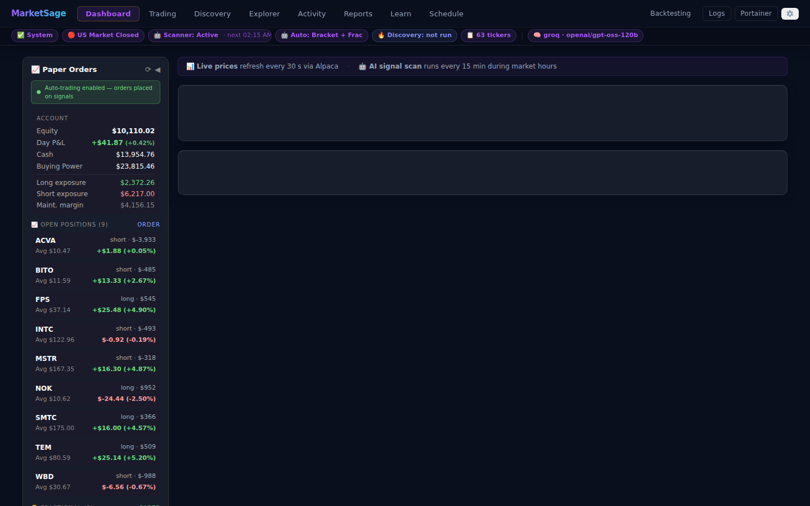
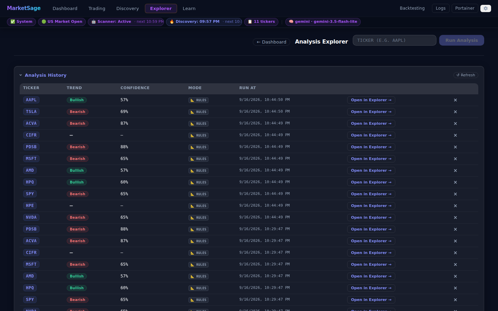
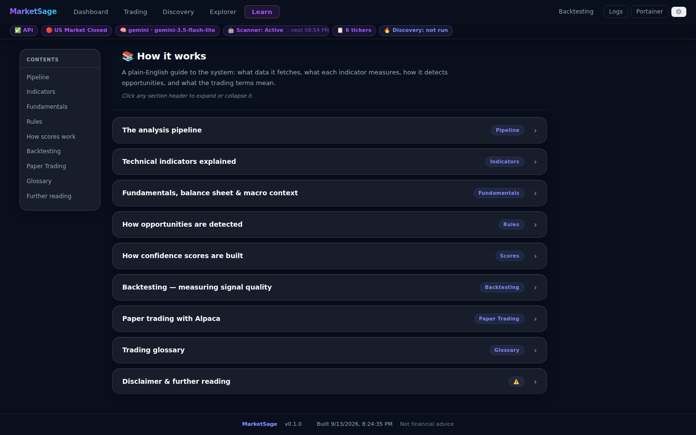
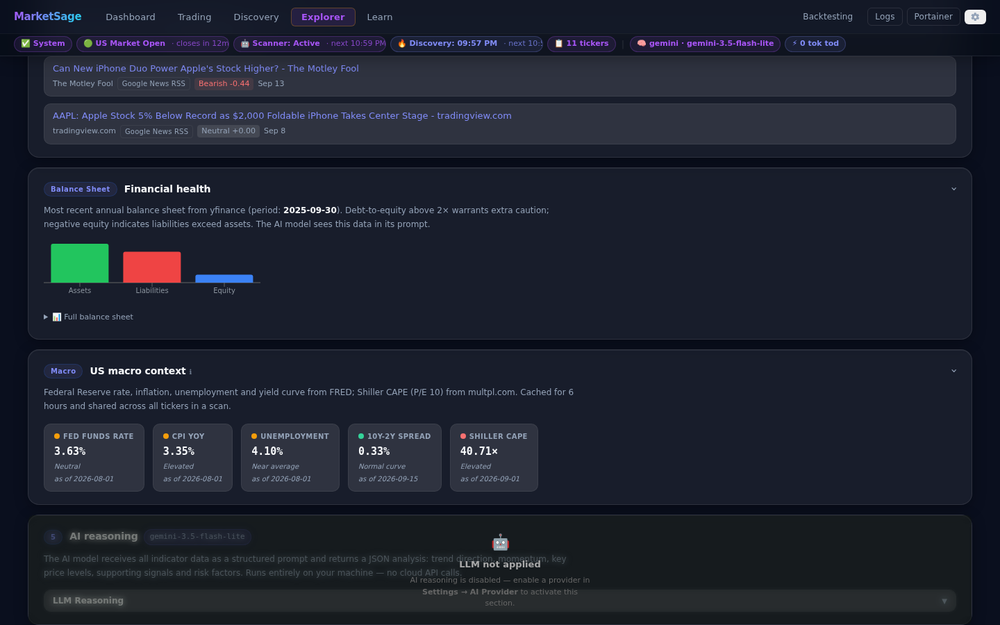

# MarketSage

**Local, zero-cost AI stock monitor.** FastAPI + Ollama (`qwen2.5:14b`) + SQLite.
Fetches live market data, runs a **local** LLM for technical analysis, detects
trading opportunities with transparent rules, stores signals, and sends alerts
via Gmail SMTP and/or Telegram.

Everything runs on your machine. **No paid or cloud APIs are used** — the AI is
a local Ollama model.

### What MarketSage analyses for each ticker

- **Price & volume** — current price, day change, volume ratio, 52-week range, MA5/MA20
- **Multi-timeframe indicators** — RSI, MACD, EMA 20/50/200, Bollinger Bands, Stochastic across 1H / 4H / 1D computed locally with the `ta` library
- **Company fundamentals** — sector, industry, market cap, trailing P/E, forward P/E (yfinance)
- **Balance sheet health** — total assets/liabilities, stockholders equity, debt, cash, debt-to-equity (yfinance; daily cache)
- **US macro context** — Fed funds rate, CPI YoY, unemployment, 10y-2y yield curve (FRED key-free CSV; 6h cache); Shiller CAPE / P/E 10 (multpl.com; 24h cache)
- **Recent news headlines** — last 7 days via Finnhub (optional; requires free `FINNHUB_API_KEY`)
- **LLM reasoning** — all of the above is assembled into a structured prompt; every call is traced end-to-end in Aspire with input/output token counts and time-to-first-token (TTFT)

> ⚠️ **Not financial advice.** This project is for educational and research
> purposes only. It does not constitute financial, investment, or trading
> advice. Markets are risky; you are solely responsible for any decisions you
> make. Nothing here is a recommendation to buy or sell any security.

---

## Screenshots

| Dashboard | Analysis Explorer |
|---|---|
|  |  |

| Learn — in-app wiki | Settings |
|---|---|
|  |  |

### Analysis deep-dive (Explorer sections)

| Technical indicators — RSI · MACD · EMA across 1H / 4H / 1D | Financial health — balance sheet + D/E |
|---|---|
|  |  |

| US macro context — Fed rate, CPI, yield curve, Shiller CAPE | AI reasoning + signals detected |
|---|---|
|  |  |

Full section-by-section walkthrough (10 screenshots) → **[docs/wiki/Home.md](docs/wiki/Home.md#explorer--section-walkthrough-aapl)**

> 📸 Screenshots are generated by [`docs/screenshots/capture.mjs`](docs/screenshots/capture.mjs) — see [`docs/screenshots/README.md`](docs/screenshots/README.md) to re-run them.

---

## Architecture

```
backend/
├── config.py         # settings + thresholds + secrets from env (.env)
├── data.py           # yfinance OHLCV + ta library -> indicators + market dict
├── analysis.py       # prompt -> local Ollama /api/chat -> parsed JSON
├── opportunities.py  # AI output + rule-based checks -> scored signals
├── database.py       # SQLite: signals + analysis_log + app_settings + ticker_memory
├── alerts.py         # Gmail SMTP + Slack webhook (confidence-gated)
├── memory.py         # per-ticker MemoryLayer — persists prior scan context to DB
├── skills/           # five pipeline skills (fetch, ai, detect, persist, alert)
├── agent.py          # TickerAgent — runs skills with retry + memory
├── orchestrator.py   # Orchestrator — prioritised watchlist dispatch, concurrency cap
├── scheduler.py      # async, market-hours-aware scan loop (uses Orchestrator)
└── main.py           # FastAPI app (endpoints + CORS + lifespan + SSE streaming)
```

Pipeline per ticker: **TickerAgent → FetchDataSkill → AIAnalysisSkill (retries) → OpportunityDetectSkill → PersistSkill → AlertSkill**.  
The **Orchestrator** sorts tickers by scan staleness and caps concurrency at 3.  
The **MemoryLayer** injects prior-scan context (`PRIOR CONTEXT`) into the AI prompt so RSI streaks and signal history inform each analysis.  
The **Analysis Explorer** UI page shows this pipeline live via Server-Sent Events, including `retry` and `memory` events.

See [docs/wiki/architecture.md](docs/wiki/architecture.md) for a full pipeline diagram and service map.

---

## Run with Docker (recommended, WSL2)

The whole stack — FastAPI backend, local Ollama (`qwen2.5:14b`), and Portainer —
runs in Docker. No Python venv or native Ollama required.

```bash
cp .env.example .env          # edit watchlist / thresholds / optional alerts

# WSL2 — start Docker first (not auto-started):
sudo service docker start

# macOS — open Docker Desktop first:
open -a Docker

make infra                    # start shared Ollama + Portainer (auto-detects GPU)
make build                    # build and start MarketSage
```

**When you are done — stop everything to free RAM/GPU:**

```bash
make down     # stops MarketSage; prompts whether to also stop Ollama + Portainer + Docker service (WSL2)
```

Then open the services:

| URL | What |
|---|---|
| http://localhost:5174 | React UI — Dashboard · Analysis Explorer · Learn · Settings |
| http://localhost:5174/docs | FastAPI interactive docs (via nginx proxy) |
| http://localhost:8010/docs | FastAPI interactive docs (direct) |
| http://localhost:18889 | Aspire — traces, metrics, structured logs |
| http://localhost:9000 | Portainer — container management |

- **First-time setup (WSL2, GPU, model download):** see **[SETUP.md](SETUP.md)**.
- **Day-to-day operation (subsequent runs, commands, endpoints):** see **[USAGE.md](USAGE.md)**.

The sections below describe running the backend **natively** (without Docker).

---

## Prerequisites

- **Python 3.11+** (uses `zoneinfo` from the stdlib)
- **[Ollama](https://ollama.com/)** running locally

### 1. Install and start Ollama

```bash
# Install Ollama (see https://ollama.com/download for your OS)
# Then pull the local model used by this project:
ollama pull qwen2.5:14b

# Make sure the server is running (usually automatic):
ollama serve
```

Ollama listens on `http://localhost:11434` by default, which matches
`OLLAMA_HOST` in `.env.example`.

### 2. Create a virtual environment & install deps

```bash
# Windows (PowerShell)
py -m venv .venv
.\.venv\Scripts\Activate.ps1

# macOS / Linux
python3 -m venv .venv
source .venv/bin/activate

pip install -r requirements.txt
```

### 3. Configure environment

```bash
cp .env.example .env      # (Windows: copy .env.example .env)
# edit .env: watchlist, thresholds, and optional email/Slack credentials
```

All secrets (SMTP App Password, Slack webhook) live in `.env`, which is
gitignored. Email and Slack are **disabled by default** — set `EMAIL_ENABLED`
/ `SLACK_ENABLED` to `true` and fill in credentials to turn them on.

---

## Run the API

```bash
uvicorn backend.main:app --reload
```

Then open the interactive docs at http://localhost:8000/docs (native uvicorn default port).

The background scheduler starts automatically and scans the watchlist every
`SCAN_INTERVAL_MINUTES` **while the US market is open** (Mon–Fri, 9:30–16:00 ET).

### Endpoints

| Method | Path                          | Description                                        |
|--------|-------------------------------|----------------------------------------------------|
| POST   | `/analyze`                    | On-demand analysis for any ticker.                 |
| POST   | `/analyze/stream`             | Same pipeline, streamed via SSE (`step` · `retry` · `memory` · `skill_error` · `result` events). |
| GET    | `/market-data/{ticker}`       | Raw market-data dict (price, fundamentals, indicators, balance sheet, macro, news). |
| GET    | `/market-data/{ticker}/history` | OHLCV + volume history (`?period=3mo&interval=1d`). |
| POST   | `/webhook/tradingview`        | Receive a TradingView Pro alert → background scan. |
| GET    | `/signals`                    | Recent stored signals (`?ticker=&limit=`).         |
| DELETE | `/signals/{id}`               | Delete a stored signal by id.                      |
| GET    | `/analysis`                   | Recent analysis-log entries across all tickers (`?limit=`). |
| DELETE | `/analysis/{id}`              | Delete an analysis-log entry by id.                |
| GET    | `/analysis/{ticker}`          | Analysis-log history for a single ticker.          |
| GET    | `/watchlist`                  | Effective watchlist + scheduler + alerts status.   |
| POST   | `/watchlist`                  | Add a ticker (`{"ticker": "GOOGL"}`).              |
| DELETE | `/watchlist/{ticker}`         | Remove a ticker (persisted in SQLite).             |
| GET    | `/settings`                   | Current effective settings (env + DB overrides).   |
| POST   | `/settings/alerts`            | Toggle alert dispatch (`{"enabled": true/false}`). |
| POST   | `/settings/scheduler`         | Start/stop auto-scan (`{"running": true/false}`). State persists across restarts. |
| POST   | `/settings/scan-interval`     | Change scan cadence (`{"minutes": 60}`).           |
| POST   | `/settings/ollama`            | Override Ollama model and/or timeout at runtime.   |
| POST   | `/data/reset`                 | Clear all signals and analysis history (preserves settings). |
| GET    | `/health`                     | Liveness + config summary.                         |

Full API reference with request/response shapes and `curl` examples: [docs/wiki/api.md](docs/wiki/api.md).

Example (Docker — use port 8010):

```bash
curl -X POST http://localhost:8010/analyze \
  -H "Content-Type: application/json" \
  -d '{"ticker": "AAPL"}'
```

Example (native uvicorn — port 8000):

```bash
curl -X POST http://localhost:8000/analyze \
  -H "Content-Type: application/json" \
  -d '{"ticker": "AAPL"}'
```

TradingView webhook payload (configure in a TradingView Pro alert):

```json
{ "ticker": "{{ticker}}", "action": "buy", "price": {{close}} }
```

---

## Run modules independently

Each module is runnable for quick manual testing:

```bash
python -m backend.config           # print resolved config (secrets masked)
python -m backend.data AAPL        # fetch unified market data
python -m backend.analysis AAPL    # data -> Ollama -> parsed analysis
python -m backend.opportunities AAPL   # full detection for one ticker
python -m backend.database         # create the DB and print row counts
python -m backend.alerts           # send a demo alert (if channels enabled)
python -m backend.scheduler        # one-shot watchlist scan (no alerts)
```

---

## Opportunity rules

An opportunity is raised when any of the following hold (merged and scored when
several agree):

- **AI signal** — the model returns a `long`/`short` setup with confidence ≥ `CONFIDENCE_FLOOR`.
- **RSI extreme** — RSI oversold/overbought on **2+** of 1H/4H/1D.
- **Volume spike** — volume ≥ `VOLUME_SPIKE_MULTIPLIER`× average **and** day move ≥ `SIGNIFICANT_MOVE_PCT`.
- **MACD crossover** — MACD above/below signal on **both** 1D and 4H.
- **Valuation extreme** — TTM P/E > 60 (severely overvalued → low-confidence short) or 0 < P/E < 8 (deeply discounted → low-confidence long). Intentionally low confidence (40–42); designed to reinforce, not drive, a signal.
- **Macro regime filter** (post-merge) — after all candidates are merged, confidence scores are adjusted by the macro environment: inverted yield curve −8 on longs; Shiller CAPE > 35 −5 on longs; CAPE < 15 +5 on longs; CPI YoY > 5% −5 on longs. Adjustments are bounded to 0–100.

Only signals at or above the confidence floor are stored and alerted.

### Scheduler

Auto-scan is **off by default**. Toggle it on from the Settings page (⚙ gear icon in the header) or via the API:

```bash
curl -X POST http://localhost:8010/settings/scheduler \
  -H "Content-Type: application/json" \
  -d '{"running": true}'
```

State is persisted to SQLite and survives container restarts.

---

## Data & tooling

- **Market data & indicators:** [yfinance](https://github.com/ranaroussi/yfinance)
  (price, fundamentals, OHLCV) + [ta](https://github.com/bukosabino/ta)
  (RSI, MACD, EMA20/50/200, Bollinger Bands, Stochastic — computed locally, no API key)
- **AI:** local [Ollama](https://ollama.com/) `qwen2.5:14b` via `/api/chat`
- **DB:** SQLite (file at `DATABASE_PATH`)
- **Charts:** [Recharts](https://recharts.org/) (RSI/MACD/EMA/price-history in the frontend)

See [docs/wiki/indicators.md](docs/wiki/indicators.md) for a full indicator reference (with screenshots) and [docs/wiki/glossary.md](docs/wiki/glossary.md) for trading terminology.

### Wiki

| Page | Content |
|---|---|
| [Architecture](docs/wiki/architecture.md) | Pipeline diagram, Docker service map, SSE design, data persistence |
| [API Reference](docs/wiki/api.md) | All endpoints with request/response shapes and `curl` examples |
| [Indicators](docs/wiki/indicators.md) | RSI, MACD, EMA, BB, Stoch, Volume, Fundamentals, Balance Sheet, Macro |
| [Settings Reference](docs/wiki/settings.md) | Every `.env` variable, defaults, runtime-mutable column |
| [Glossary](docs/wiki/glossary.md) | Alphabetical trading and macro terminology |
| [Observability](docs/wiki/observability.md) | OTEL span hierarchy, Aspire usage, log reference |
| [Development](docs/wiki/development.md) | VS Code setup, `make lint`, test layout, Docker naming, PR/CI notes |

---

## Disclaimer

This software is provided "as is", without warranty of any kind. It is **not
financial advice** and must not be relied upon for real trading decisions.
