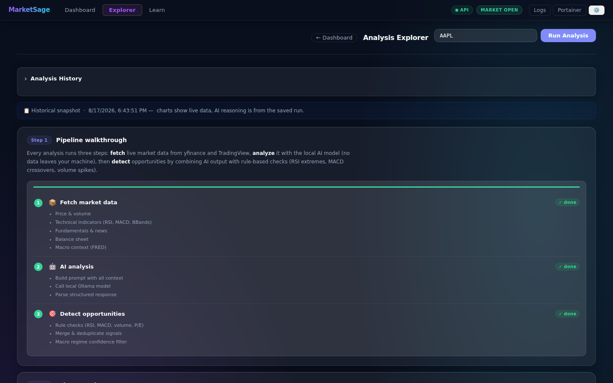
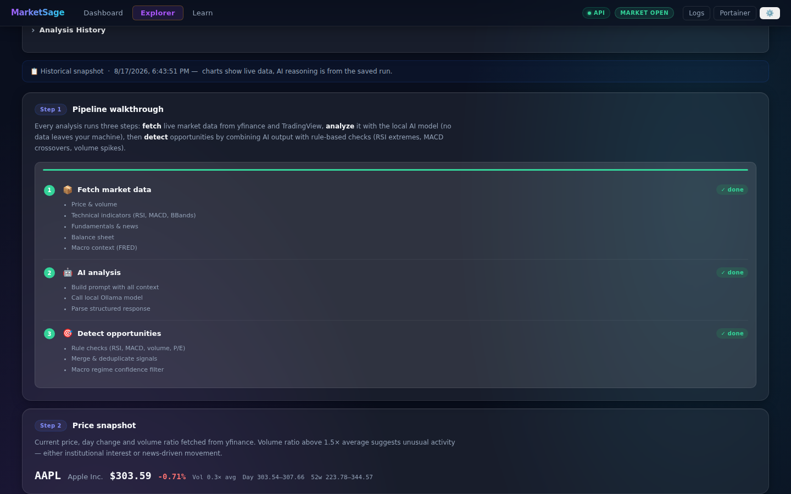
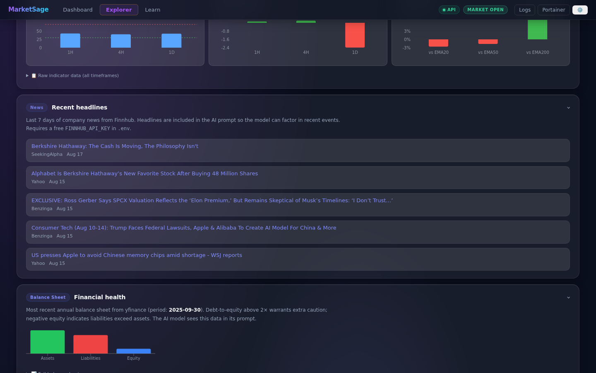
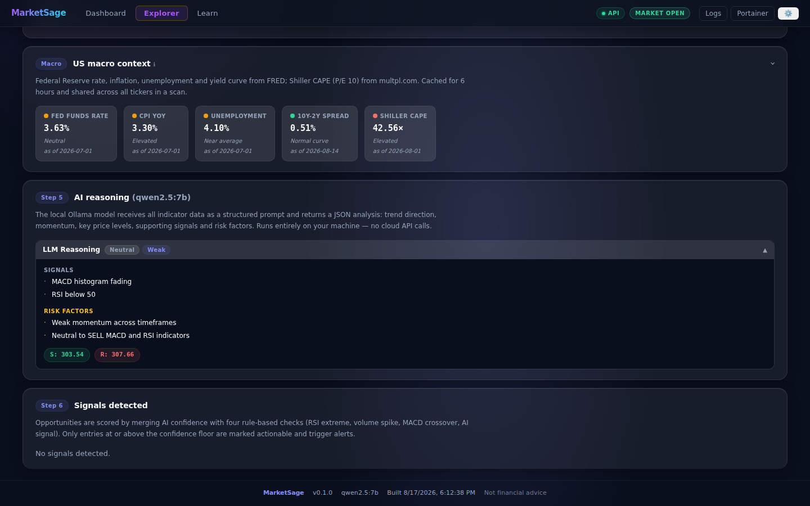

# MarketSage — Wiki Home

**Local, zero-cost AI stock monitor.**
FastAPI · Ollama (`qwen2.5:14b`) · React · SQLite.

Everything runs on your machine — no paid APIs, no cloud AI, no subscription.

> ⚠️ **Not financial advice.** For educational and research use only.

---

## What does it do?

For each ticker in your watchlist (or on demand) the system runs a six-step pipeline:

```
yfinance          → live price, volume, fundamentals, balance sheet
yfinance + ta     → OHLCV history → RSI / MACD / EMA / BB / Stoch (1H · 4H · 1D)
FRED + multpl.com → US macro: Fed rate, CPI, unemployment, yield curve, Shiller CAPE
Finnhub           → optional news headlines (free API key)
Prompt builder    → assembles the market dict into a structured prompt
Local Ollama      → qwen2.5:14b reasons about the data → JSON output
Rule engine       → 5 rule checks + macro regime filter → scored, confidence-filtered signals
SQLite            → signals + analysis log persisted locally
Alerts            → optional Gmail SMTP · Slack · Telegram bot
```

Results are visible in the React UI (Dashboard · Explorer · Learn · Settings) and via the REST API.

---

## Screenshots

| Dashboard | Learn |
|---|---|
|  |  |

| Analysis Explorer | Settings |
|---|---|
|  |  |

### Explorer — section walkthrough (AAPL)

Each section of the Analysis Explorer, shown after opening a saved analysis:

| Pipeline walkthrough | Price snapshot |
|---|---|
|  |  |

| Company overview | Historical chart |
|---|---|
|  |  |

| Technical indicators | Recent headlines |
|---|---|
|  |  |

| Financial health | US macro context |
|---|---|
|  |  |

| AI reasoning | Signals detected |
|---|---|
|  |  |

### Re-capturing screenshots

Screenshots are regenerated by a Playwright script checked into the repo.
Run it any time the UI changes or you want fresh images:

```bash
# One-time setup (first machine):
cd docs/screenshots
npm install
npx playwright install chromium

# Capture (stack must be running + at least one saved analysis):
node capture.mjs
```

See [docs/screenshots/README.md](../screenshots/README.md) for full instructions and troubleshooting.

---

## Quick navigation

| Page | What's in it |
|---|---|
| [Home](Home.md) | This page |
| [Architecture](architecture.md) | Pipeline diagram, Docker service map, SSE streaming design, data persistence |
| [API Reference](api.md) | All endpoints with full request/response shapes and `curl` examples |
| [Settings Reference](settings.md) | Every `.env` variable, defaults, and which ones can be changed at runtime |
| [Indicators](indicators.md) | RSI, MACD, EMA, Bollinger Bands, Stochastic, Volume ratio, Fundamentals, Balance Sheet, Macro — definitions and how they're used |
| [Glossary](glossary.md) | Alphabetical trading and macro terminology |
| [Observability](observability.md) | OTEL span hierarchy, Aspire usage guide, log lines |

---

## Service URLs (when the stack is running)

| URL | Service |
|---|---|
| http://localhost:5174 | React UI — Dashboard · Analysis Explorer · Learn · Settings |
| http://localhost:8010/docs | FastAPI interactive docs (OpenAPI) |
| http://localhost:18889 | Aspire — structured logs, traces, metrics |
| http://localhost:9000 | Portainer — container management |

---

## Key files

```
backend/
├── config.py         — env-driven settings, thresholds, secrets
├── data.py           — yfinance OHLCV + ta library → indicators + market dict
├── analysis.py       — prompt → Ollama /api/chat → parsed JSON
├── opportunities.py  — AI output + 5 rule checks + macro filter → scored signals
├── database.py       — SQLite: signals, analysis_log, app_settings
├── alerts.py         — Gmail SMTP · Slack · Telegram bot (confidence-gated)
├── scheduler.py      — async, market-hours-aware scan loop
└── main.py           — FastAPI: endpoints, SSE streaming, lifespan

frontend/src/
├── App.jsx           — all UI components + custom hooks
└── index.css         — component styles

docker/
├── frontend/nginx.conf  — nginx reverse proxy (SSE buffering off)
└── ...

docs/wiki/            — you are here
tests/
└── smoke_test.py     — offline regression test (36 checks, no live APIs)
```

---

## Getting started

- **First time:** [SETUP.md](../../SETUP.md)
- **Day-to-day commands:** [USAGE.md](../../USAGE.md)
- **All configuration variables:** [Settings Reference](settings.md)
- **Opportunity-detection rules and thresholds:** [Architecture](architecture.md)
- **What RSI/MACD/EMA mean:** [Indicators](indicators.md)
- **Unfamiliar trading or macro terms:** [Glossary](glossary.md)
- **Traces and logs in Aspire:** [Observability](observability.md)
