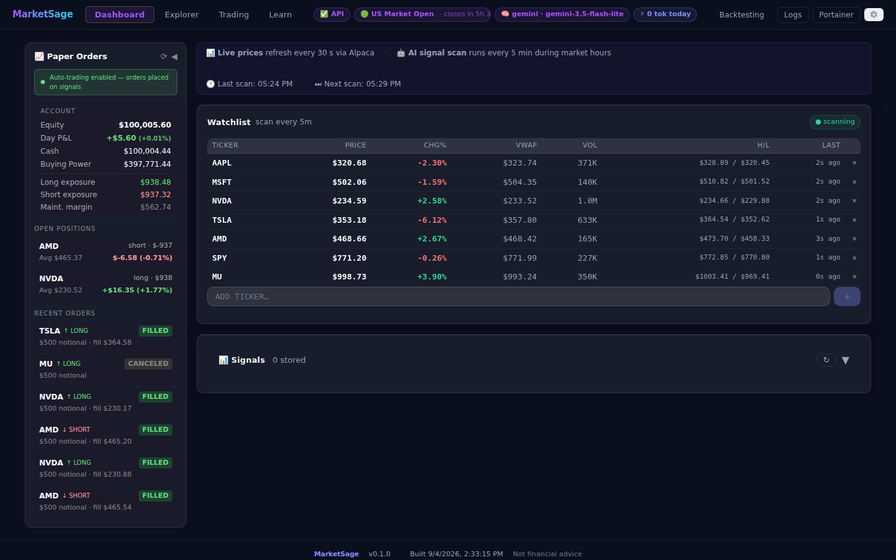
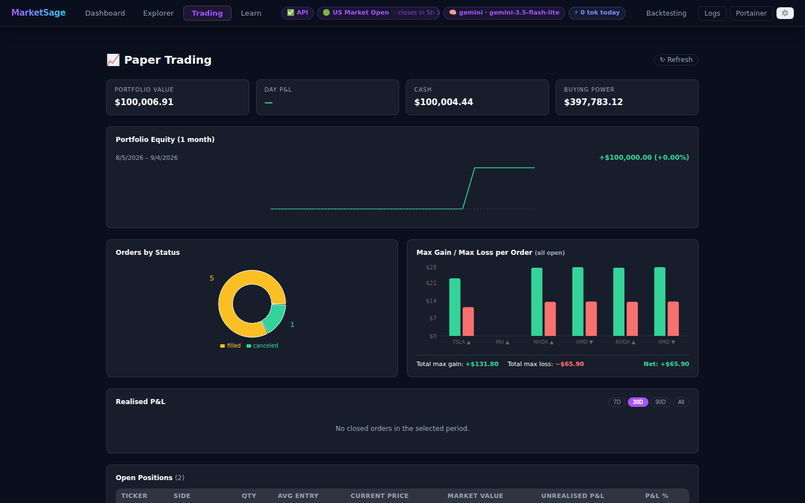
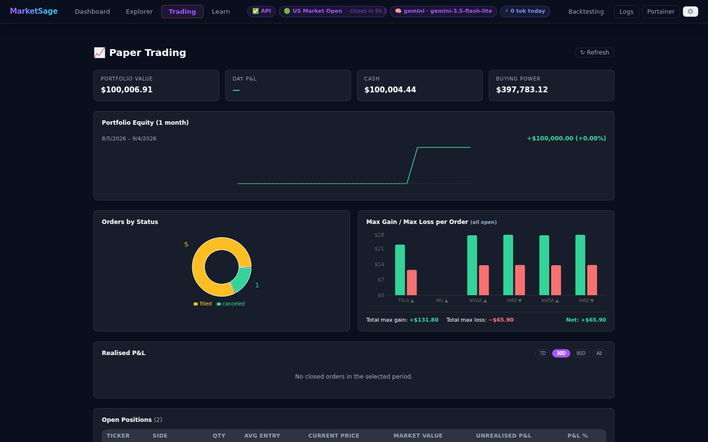
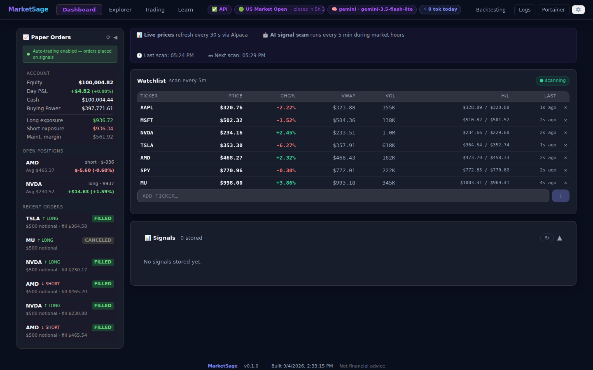

# MarketSage — Wiki Home

**Local, zero-cost AI stock monitor.**
FastAPI · Ollama (`qwen2.5:14b`) · React · SQLite.

Runs locally with **Ollama** (default) or via free cloud inference (**Groq**) — no paid APIs, no subscription required.

> ⚠️ **Not financial advice.** For educational and research use only.

---

## What does it do?

For each ticker in your watchlist (or on demand), a **TickerAgent** runs six sequential skills:

```
MemoryLayer       → load prior scan context (signal history, RSI streak, price trend)
FetchDataSkill    → yfinance price + fundamentals + ta indicators (1H/4H/1D)
                    + balance sheet · FRED macro · multpl.com CAPE · Finnhub news
AIAnalysisSkill   → builds prompt with PRIOR CONTEXT, sends to local Ollama qwen2.5:14b
                    → retries up to 2× on OllamaError with exponential back-off
OpportunityDetect → 5 rule checks (RSI, MACD, volume, valuation, AI signal)
                    + macro regime confidence filter → scored, confidence-filtered signals
PersistSkill      → save analysis log + signals to SQLite
PaperTradeSkill   → places Alpaca bracket orders for actionable signals (optional)
AlertSkill        → optional Gmail SMTP · Telegram bot
MemoryLayer       → update ticker_memory for next scan
```

The **Orchestrator** sorts watchlist tickers by scan staleness and caps concurrency at 3 (respects Ollama VRAM). Results are visible in the React UI and via the REST API. Live progress streams via SSE — including `retry` and `memory` events.

**Navigation:**
- **Left (primary):** Dashboard · Explorer · Trading · Learn
- **Right (secondary):** Backtesting · Logs · Portainer · ⚙ Settings

After each scan, the scheduler syncs open Alpaca paper orders (status, fill price, P&L) back to the local DB. The **Dashboard** shows a live watchlist price table (Price · Chg% · VWAP · Vol · H/L) updated every 30 s during market hours and a collapsible **Paper Orders** sidebar for quick order glances. The dedicated **Trading** tab provides the full paper-trading dashboard: account metrics, portfolio equity curve, insight charts (Orders by Status, Max Gain/Loss, Confidence, Realised P&L), open positions table, and a full orders table with expandable per-row detail.

---

## Screenshots

| Dashboard (live prices + Paper Orders) | Learn |
|---|---|
|  |  |

| Analysis Explorer | Settings |
|---|---|
|  |  |

| Paper Orders sidebar (Dashboard) | Trading page — account + charts |
|---|---|
|  |  |

| Trading page — orders table | Signal card with order status |
|---|---|
|  |  |

### Explorer — section walkthrough (AAPL)

Each section of the Analysis Explorer, shown after opening a saved analysis:

| Pipeline walkthrough | Price snapshot |
|---|---|
|  |  |

| Company overview | Historical chart |
|---|---|
|  |  |

| Technical indicators | Recent headlines |
|---|---|
|  |  |

| Financial health | US macro context |
|---|---|
|  |  |

| AI reasoning | Signals detected |
|---|---|
|  |  |

### Re-capturing screenshots

Screenshots are regenerated by a Playwright script checked into the repo.
Run it any time the UI changes or you want fresh images:

```bash
# One-time setup (first machine):
cd docs/screenshots
npm install
npx playwright install chromium

# Capture (stack must be running + at least one saved analysis):
node capture.mjs
```

See [docs/screenshots/README.md](../screenshots/README.md) for full instructions and troubleshooting.

---

## Quick navigation

| Page | What's in it |
|---|---|
| [Home](Home.md) | This page |
| [Architecture](architecture.md) | Pipeline diagram, Docker service map, SSE streaming design, data persistence |
| [API Reference](api.md) | All endpoints with full request/response shapes and `curl` examples |
| [Settings Reference](settings.md) | Every `.env` variable, defaults, and which ones can be changed at runtime |
| [Cloud LLM Providers](cloud-llm.md) | Free Groq setup, model reference, switching between providers |
| [How Signals Work](how-signals-work.md) | End-to-end walkthrough: AI verdict → 5 rule checks → merge + corroboration bonus → macro filter → confidence floor |
| [Indicators](indicators.md) | RSI, MACD, EMA, Bollinger Bands, Stochastic, Volume ratio, Fundamentals, Balance Sheet, Macro — definitions and how they're used |
| [Backtesting — Concepts](backtesting-explained.md) | What backtesting does, each metric in plain English, the confidence-floor sweep, and how to tune `CONFIDENCE_FLOOR` |
| [Backtesting — Reference](backtesting.md) | Parameters, ATR bracket, LLM-mode quota, runs comparator, `/backtest*` API endpoints, schema |
| [Paper Trading](paper-trading.md) | Alpaca paper account setup, bracket orders, live market data, `/paper/*` API endpoints |
| [Glossary](glossary.md) | Alphabetical trading and macro terminology |
| [Observability](observability.md) | OTEL span hierarchy, Aspire usage guide, log lines |

---

## Service URLs (when the stack is running)

| URL | Service |
|---|---|
| http://localhost:5174 | React UI — Dashboard · Analysis Explorer · Backtesting · Learn · Settings |
| http://localhost:8010/docs | FastAPI interactive docs (OpenAPI) |
| http://localhost:18889 | Aspire — structured logs, traces, metrics |
| http://localhost:9000 | Portainer — container management |

---

## Key files

```
backend/
├── config.py         — env-driven settings, thresholds, secrets
├── data.py           — yfinance OHLCV + ta library → indicators + market dict
├── analysis.py       — prompt builder → Ollama /api/chat → parsed JSON
├── opportunities.py  — 5 rule checks + macro regime filter → scored signals
├── database.py       — SQLite: signals, analysis_log, app_settings, ticker_memory,
│                       backtest_runs, backtest_trades
├── alerts.py         — Gmail SMTP · Telegram bot (confidence-gated)
├── memory.py         — MemoryLayer: load/update ticker_memory; 48h TTL
├── agent.py          — TickerAgent: runs skills with retry + memory + OTEL spans/metrics
├── orchestrator.py   — Orchestrator: staleness-sorted dispatch, concurrency cap=3
├── scheduler.py      — async, market-hours-aware scan loop (uses Orchestrator)
├── skills/           — five pipeline skills (fetch_data, ai_analysis, opportunity_detect,
│                       persist, alert)
├── prompts/          — system_prompt.md (loaded at runtime), user_prompt_structure.md
├── backtest.py       — backtesting engine: replay, ATR bracket, outcome evaluation, metrics
└── main.py           — FastAPI: endpoints, SSE streaming, lifespan, OTEL setup

frontend/src/
├── App.jsx           — all UI components + custom hooks
└── index.css         — component styles

infra/
├── docker-compose.yml          — MarketSage stack (backend + frontend + aspire)
├── docker-compose.infra.yml    — shared infra (Ollama + Portainer)
├── backend/Dockerfile
├── frontend/Dockerfile + nginx.conf   — nginx reverse proxy (SSE buffering off)
└── start-infra.sh

docs/wiki/            — you are here
tests/
└── smoke_test.py     — offline regression test (no live APIs); run with `make smoke`
```

---

## Getting started

- **First time:** [SETUP.md](../../SETUP.md)
- **Day-to-day commands:** [USAGE.md](../../USAGE.md)
- **All configuration variables:** [Settings Reference](settings.md)
- **Opportunity-detection rules and thresholds:** [Architecture](architecture.md)
- **What RSI/MACD/EMA mean:** [Indicators](indicators.md)
- **Unfamiliar trading or macro terms:** [Glossary](glossary.md)
- **Traces and logs in Aspire:** [Observability](observability.md)
