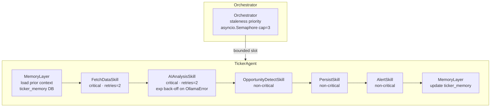
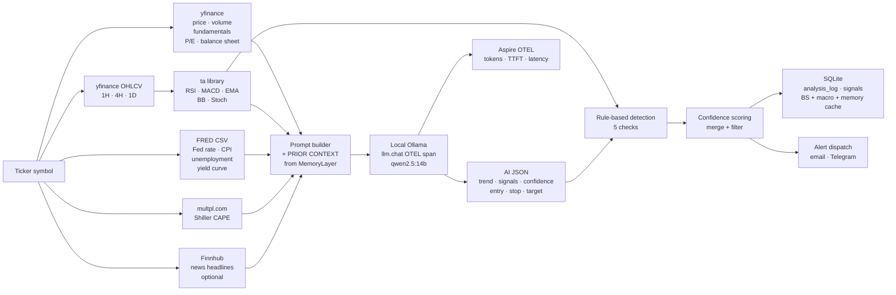

# Architecture

System design for **MarketSage** — a local, zero-cost AI stock monitor.

---

## Agent pipeline

Every analysis (scheduled or on-demand) runs through the **TickerAgent**. The agent executes five sequential skills; critical skills that fail stop the pipeline early, non-critical ones are skipped and logged.



### Data flow per skill



### Skill reference


| Skill | Module | Critical | Retries | What happens |
|---|---|---|---|---|
| **FetchDataSkill** | `backend/skills/fetch_data.py` | ✅ | 2 (3s base) | Calls `get_market_data()` — yfinance price/fundamentals + ta indicators + balance sheet + macro + news; OTEL spans |
| **AIAnalysisSkill** | `backend/skills/ai_analysis.py` | ✅ | 2 (2s base) | Calls `analyze(market_data, memory=...)` — builds prompt with PRIOR CONTEXT section if memory available, sends to Ollama, parses JSON; retries on `OllamaError` with exponential back-off |
| **OpportunityDetectSkill** | `backend/skills/opportunity_detect.py` | ❌ | 0 | `detect_opportunities()` + `filter_by_confidence()` — 5 rule checks + macro regime filter |
| **PersistSkill** | `backend/skills/persist.py` | ❌ | 0 | `save_analysis()` + `save_signal()` per actionable opportunity; each DB write individually guarded |
| **AlertSkill** | `backend/skills/alert.py` | ❌ | 0 | `send_alert()` per actionable opportunity; respects `send_alerts` flag |

### Retry back-off

`can_retry` skills retry up to `max_retries` extra attempts. Delay between attempts:

```
delay = retry_delay_base × 2^(attempt − 1)
```

e.g. `AIAnalysisSkill` (base=2s): attempt 1 → 2s wait, attempt 2 → 4s wait.

A `type:"retry"` SSE event is emitted before each retry so the UI can show progress.

### Memory (prior context)

After every agent run the **MemoryLayer** writes a row to `ticker_memory` (DB UPSERT). On the next run it injects a `PRIOR CONTEXT` block into the AI prompt:

```
PRIOR CONTEXT (from last scan 4h ago):
  Last signal: LONG, confidence 72
  RSI oversold streak: 2 consecutive scans
  Price since last scan: −1.4%
```

Memory expires after 48 hours (rows older than TTL are ignored). The `type:"memory"` SSE event is emitted when prior context is loaded.

---

## Opportunity detection rules

Six checks in two phases:

### Phase 1 — independent rule checks (any combination can fire)

| Rule | Condition | Signal direction |
|---|---|---|
| **AI signal** | Model returns `long`/`short` with confidence ≥ floor | As returned |
| **RSI extreme** | RSI < 30 or > 70 on 2+ of 1H / 4H / 1D | oversold → long · overbought → short |
| **MACD crossover** | MACD above/below signal on both 1D and 4H | above → long · below → short |
| **Volume spike** | Volume ≥ `VOLUME_SPIKE_MULTIPLIER`× avg AND day move ≥ `SIGNIFICANT_MOVE_PCT` | direction from price move |
| **Valuation extreme** | TTM P/E > 60 → severely overvalued; 0 < P/E < 8 → deeply discounted | confidence intentionally low (40–42) |

Multiple matching rules for the same ticker are merged: the type is determined by
majority vote and the confidence score is boosted by each additional agreement.

### Phase 2 — macro regime confidence filter (post-merge)

After merging, confidence scores are adjusted by the macro environment:

| Condition | Long candidates | Short candidates |
|---|---|---|
| Yield curve inverted (T10Y2Y < 0) | −8 confidence | +3 confidence |
| Shiller CAPE > 35 | −5 confidence | +3 confidence |
| Shiller CAPE < 15 | +5 confidence | −3 confidence |
| CPI YoY > 5% | −5 confidence | no change |

Adjustments are bounded to 0–100. Only signals at or above `CONFIDENCE_FLOOR` (default: 65) are stored and alerted.

---

## SSE streaming

The `POST /analyze/stream` endpoint runs the full **TickerAgent** and streams events as they are emitted.

```
Client                                     Backend
  |                                           |
  |-- POST /analyze/stream ------------------>|
  |                                           |  MemoryLayer.load()
  |<-- data: {type:"memory", ticker, context}-|     (if prior context found)
  |                                           |  FetchDataSkill.run()
  |<-- data: {type:"step", step:"fetch",      |
  |            status:"running"}          ----|
  |<-- data: {type:"step", step:"fetch",      |
  |            status:"done", elapsed_ms} ----|
  |                                           |  AIAnalysisSkill.run()  (may retry)
  |<-- data: {type:"step", step:"analyze",    |
  |            status:"running"}          ----|
  |<-- data: {type:"retry", skill:"ai_analysis",   (if Ollama timeout)
  |            attempt:1, delay_s:2}      ----|
  |<-- data: {type:"step", step:"analyze",    |
  |            status:"done", elapsed_ms} ----|
  |<-- data: {type:"step", step:"detect", ...}-|
  |<-- data: {type:"step", step:"persist", ...}-|
  |<-- data: {type:"step", step:"alert",  ...}-|
  |<-- data: {type:"result", ticker, analysis, |
  |            opportunities, actionable,  ...}|
```

### Event types

| `type` | When emitted | Key fields |
|---|---|---|
| `step` | Before and after each skill | `step`, `status` (`running`/`done`/`error`), `elapsed_ms` |
| `retry` | Before a skill retry sleep | `skill`, `attempt`, `delay_s` |
| `memory` | After loading prior context | `ticker`, `context` (last signal, RSI streak, price trend) |
| `skill_error` | Non-critical skill failed | `skill`, `error` |
| `result` | After all skills complete | Full payload: `ticker`, `analysis`, `opportunities`, `actionable`, `elapsed_s` |

nginx must have `proxy_buffering off` on the `/api/` location block — without this,
nginx buffers the response and the client sees nothing until the stream ends.

---

## Docker services

All Docker files live in [`infra/`](https://github.com/AlexandrosPlessias/offgrid-trader/tree/main/infra). Use the `Makefile` at the project root:

```bash
make infra    # start shared Ollama + Portainer (auto-detects GPU)
make build    # build and start the MarketSage stack
make up       # start without rebuilding
make down     # stop the MarketSage stack
make logs     # follow backend + frontend logs
make smoke    # run smoke tests inside the backend container
```

```
┌─────────────────── ai-shared network ──────────────────────┐
│                                                             │
│  ┌──────────────────────┐   ┌──────────────────────────┐  │
│  │  ollama              │   │  portainer               │  │
│  │  :11434 (internal)   │   │  :9000 → host:9000       │  │
│  └──────────────────────┘   └──────────────────────────┘  │
│                                                             │
└─────────────────────────────────────────────────────────────┘

┌─────────────── offgrid-net (internal) ─────────────────────────┐
│                                                                  │
│  ┌────────────────┐      ┌────────────────┐                    │
│  │  backend       │      │  frontend      │                    │
│  │  FastAPI :8000 │      │  nginx :5173   │                    │
│  │  → host:8010   │      │  → host:5174   │                    │
│  └────────┬───────┘      └────────┬───────┘                    │
│           │                       │                             │
│  ┌────────┴───────┐      proxies /api/* → backend:8000         │
│  │  aspire-offgrid│      proxies /docs   → backend:8000        │
│  │  :18889        │                                             │
│  │  → host:18889  │                                             │
│  └────────────────┘                                             │
│                                                                  │
└──────────────────────────────────────────────────────────────────┘
```

Both networks connect to `ollama` — the backend talks to it at `http://ollama:11434`.

### Shared infrastructure (`infra/docker-compose.infra.yml`)

| Service | Purpose | Port |
|---|---|---|
| `ollama` | Local LLM server | 11434 (internal) |
| `portainer` | Container management UI | 9000 |
| `ollama-pull` | One-shot model download on first run | — |

### App stack (`infra/docker-compose.yml`)

| Service | Purpose | Port |
|---|---|---|
| `backend` | FastAPI API server | 8010 (→ internal 8000) |
| `frontend` | nginx serving built Vite/React app | 5174 (→ internal 5173) |
| `aspire-offgrid` | OpenTelemetry collector + Aspire dashboard | 18889 |

---

## Data persistence

| What | Path | Notes |
|---|---|---|
| Signals | `./data/offgrid_trader.db` — `signals` table | SQLite; bind-mounted; survives `make down` |
| Analysis log | same DB, `analysis_log` table | Columns: `analysis_json`, `market_snapshot`, `opportunities_json` (all rule-based scores), `actionable_json` (above-floor scores). Old rows have `NULL` for the opportunities columns. |
| App settings | same DB, `app_settings` table | Key-value; runtime-mutable without restart (scheduler state, alerts toggle, Ollama overrides) |
| Balance sheet cache | same DB, `app_settings` table | Key `bs_cache:{ticker}`; refreshed daily |
| Macro cache | same DB, `app_settings` table | Key `macro_cache`; refreshed every 6 hours; global (shared across all tickers) |
| **Ticker memory** | same DB, **`ticker_memory` table** | One row per ticker (`TEXT PRIMARY KEY`); columns: `last_scan`, `last_signal`, `last_confidence`, `consecutive_oversold`, `consecutive_overbought`, `last_price`, `price_trend_pct`; UPSERT on every agent run; expires after 48 hours |
| Ollama model weights | `ollama_models` Docker volume | Shared with other AI projects; never re-downloaded |
| Portainer config | `portainer_data` Docker volume | Shared |

---

## Observability

Every analysis run is fully traced and metered. See [observability.md](observability.md) for the complete span hierarchy and Aspire usage guide.

### OTEL spans

| Span | Scope | Key attributes |
|---|---|---|
| `agent.run` | One per `TickerAgent.run()` call | `ticker`, `skills.count`, `agent.success`, `agent.actionable`, `agent.elapsed_ms`, `agent.errors` |
| `skill.<name>` | One per skill attempt (e.g. `skill.ai_analysis`) | `skill.name`, `skill.critical`, `skill.can_retry`, `ticker`, `skill.attempt`, `skill.elapsed_ms`, `skill.success`, `skill.error` |
| `data.fetch_*`, `llm.chat` | Inside `FetchDataSkill` / `AIAnalysisSkill` | See [observability.md](observability.md) |

### OTEL metric instruments (`marketsage.agent` meter)

| Instrument | Type | Dimensions | What it measures |
|---|---|---|---|
| `marketsage.agent.runs` | Counter | `ticker`, `success` | Completed pipeline runs |
| `marketsage.agent.duration` | Histogram | `ticker`, `success` | Total pipeline wall-clock time (ms) |
| `marketsage.skill.calls` | Counter | `skill`, `success`, `attempt` | Individual skill executions (each retry is a separate call) |
| `marketsage.skill.duration` | Histogram | `skill`, `success` | Per-skill wall-clock time (ms) |
| `marketsage.skill.retries` | Counter | `skill`, `ticker` | Retry events triggered by transient failures |

All instruments are visible in Aspire's **Metrics** tab at http://localhost:18889.

---

## Configuration

All configuration is via `.env` (copied from `.env.example`). Key variables:

| Variable | Default | Notes |
|---|---|---|
| `WATCHLIST` | `AAPL,MSFT,NVDA,TSLA,AMD,SPY` | Comma-separated tickers; overridable at runtime via UI |
| `SCAN_INTERVAL_MINUTES` | `15` | Minutes between scans while market is open |
| `CONFIDENCE_FLOOR` | `65` | Minimum 0–100 score to be actionable |
| `OLLAMA_MODEL` | `qwen2.5:7b` | Model tag; `qwen2.5:14b` recommended on 16+ GB RAM |
| `ALERTS_SEND_ENABLED` | `false` | Can also be toggled at runtime from the UI |
| `FINNHUB_API_KEY` | *(unset)* | Optional — enables recent news headlines in AI prompts |
| `OTEL_INCLUDE_LLM_CONTENT` | `false` | When `true`, full LLM prompt and response text are added as span events in Aspire. Default `false` — prompts contain sensitive ticker data. |
| `OTEL_EXPORTER_OTLP_ENDPOINT` | (auto in Docker) | Set to `http://aspire-offgrid:18889` in Compose |

See `.env.example` for the full list including SMTP and Telegram credentials.

See [observability.md](observability.md) for the full OTEL span hierarchy and Aspire usage guide.
