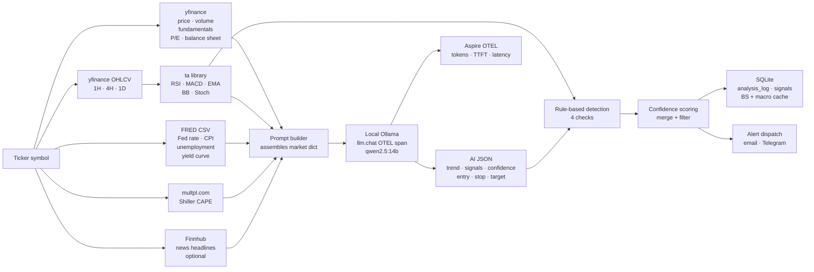

# Architecture

System design for **MarketSage** — a local, zero-cost AI stock monitor.

---

## Pipeline

Every analysis (scheduled or ad-hoc) flows through the same steps:



### Steps in detail


| Step | Module | What happens |
|---|---|---|
| 1. Fetch price | `backend/data.py` — `fetch_yfinance()` | OHLCV, fundamentals (P/E trailing + forward, market cap, sector), 20-day averages — OTEL span: `data.fetch_price_fundamentals` |
| 2. Indicators | `backend/data.py` — `compute_indicators()` | Downloads OHLCV (1y@1h, 2y@1d), resamples to 4H, computes RSI/MACD/EMA/BB/Stoch via `ta` library — OTEL span: `data.compute_indicators` |
| 3. Balance sheet | `backend/data.py` — `fetch_balance_sheet()` | Annual balance sheet from yfinance (assets/liabilities/equity/debt/cash/D:E); daily DB cache per ticker — OTEL span: `data.fetch_balance_sheet` |
| 4. Macro | `backend/data.py` — `fetch_fred_macro()` | FEDFUNDS/CPI YoY/UNRATE/T10Y2Y from FRED key-free CSV; Shiller CAPE from multpl.com; global 6h DB cache — OTEL span: `data.fetch_macro` |
| 5. News | `backend/data.py` — `fetch_finnhub_news()` | Optional: last 7 days of headlines (requires `FINNHUB_API_KEY`) — returns `List[Dict]` with source/url/date — OTEL span: `data.fetch_news` |
| 6. Prompt | `backend/analysis.py` — `build_prompt()` | All indicator data + balance sheet + macro + P/E + news assembled into structured prompt |
| 7. AI | `backend/analysis.py` — `call_ollama()` | Prompt sent to Ollama `/api/chat`; response parsed from JSON — OTEL span: `llm.chat` (token counts, TTFT, latency from Ollama response body) |
| 8. Detect | `backend/opportunities.py` — `detect_opportunities()` | 5 rule-based checks run on market data + AI output; candidates merged, then post-merge macro regime confidence filter applied |
| 9. Persist | `backend/database.py` | `save_analysis()` stores full analysis log; `save_signal()` stores each actionable signal |
| 10. Alert | `backend/alerts.py` | Confidence-gated dispatch to email (Gmail SMTP) and Telegram bot |

---

## Opportunity detection rules

Six checks in two phases:

### Phase 1 — independent rule checks (any combination can fire)

| Rule | Condition | Signal direction |
|---|---|---|
| **AI signal** | Model returns `long`/`short` with confidence ≥ floor | As returned |
| **RSI extreme** | RSI < 30 or > 70 on 2+ of 1H / 4H / 1D | oversold → long · overbought → short |
| **MACD crossover** | MACD above/below signal on both 1D and 4H | above → long · below → short |
| **Volume spike** | Volume ≥ `VOLUME_SPIKE_MULTIPLIER`× avg AND day move ≥ `SIGNIFICANT_MOVE_PCT` | direction from price move |
| **Valuation extreme** | TTM P/E > 60 → severely overvalued; 0 < P/E < 8 → deeply discounted | confidence intentionally low (40–42) |

Multiple matching rules for the same ticker are merged: the type is determined by
majority vote and the confidence score is boosted by each additional agreement.

### Phase 2 — macro regime confidence filter (post-merge)

After merging, confidence scores are adjusted by the macro environment:

| Condition | Long candidates | Short candidates |
|---|---|---|
| Yield curve inverted (T10Y2Y < 0) | −8 confidence | +3 confidence |
| Shiller CAPE > 35 | −5 confidence | +3 confidence |
| Shiller CAPE < 15 | +5 confidence | −3 confidence |
| CPI YoY > 5% | −5 confidence | no change |

Adjustments are bounded to 0–100. Only signals at or above `CONFIDENCE_FLOOR` (default: 65) are stored and alerted.

---

## SSE streaming

The `POST /analyze/stream` endpoint exposes the same pipeline as an async SSE stream.

```
Client                                  Backend
  |                                        |
  |-- POST /analyze/stream --------------->|
  |                                        |-- fetch_yfinance()
  |<-- data: {step:fetch, status:running} -|
  |                                        |   (completes)
  |<-- data: {step:fetch, status:done}  ---|
  |                                        |-- call_ollama()
  |<-- data: {step:analyze,status:running}-|
  |                                        |   (completes ~14s)
  |<-- data: {step:analyze, status:done} --|
  |                                        |-- detect_opportunities()
  |<-- data: {step:detect, status:running}-|
  |<-- data: {step:detect, status:done}  --|
  |                                        |-- save_analysis() + save_signal()
  |<-- data: {type:result, ...full payload}|
```

nginx must have `proxy_buffering off` on the `/api/` location block — without this,
nginx buffers the response and the client sees nothing until the stream ends.

---

## Docker services

```
┌─────────────────── ai-shared network ──────────────────────┐
│                                                             │
│  ┌──────────────────────┐   ┌──────────────────────────┐  │
│  │  ollama              │   │  portainer               │  │
│  │  :11434 (internal)   │   │  :9000 → host:9000       │  │
│  └──────────────────────┘   └──────────────────────────┘  │
│                                                             │
└─────────────────────────────────────────────────────────────┘

┌─────────────── offgrid-net (internal) ─────────────────────────┐
│                                                                  │
│  ┌────────────────┐      ┌────────────────┐                    │
│  │  backend       │      │  frontend      │                    │
│  │  FastAPI :8000 │      │  nginx :5173   │                    │
│  │  → host:8010   │      │  → host:5174   │                    │
│  └────────┬───────┘      └────────┬───────┘                    │
│           │                       │                             │
│  ┌────────┴───────┐      proxies /api/* → backend:8000         │
│  │  aspire-offgrid│      proxies /docs   → backend:8000        │
│  │  :18889        │                                             │
│  │  → host:18889  │                                             │
│  └────────────────┘                                             │
│                                                                  │
└──────────────────────────────────────────────────────────────────┘
```

Both networks connect to `ollama` — the backend talks to it at `http://ollama:11434`.

### Shared infrastructure (`docker-compose.infra.yml`)

| Service | Purpose | Port |
|---|---|---|
| `ollama` | Local LLM server | 11434 (internal) |
| `portainer` | Container management UI | 9000 |
| `ollama-pull` | One-shot model download on first run | — |

### App stack (`docker-compose.yml`)

| Service | Purpose | Port |
|---|---|---|
| `backend` | FastAPI API server | 8010 (→ internal 8000) |
| `frontend` | nginx serving built Vite/React app | 5174 (→ internal 5173) |
| `aspire-offgrid` | OpenTelemetry collector + Aspire dashboard | 18889 |

---

## Data persistence

| What | Path | Notes |
|---|---|---|
| Signals + analysis log | `./data/offgrid_trader.db` | SQLite; bind-mounted; survives `docker compose down` |
| App settings (watchlist overrides, alerts toggle, Ollama overrides) | same DB, `app_settings` table | Key-value store; runtime-mutable without restart |
| Balance sheet cache | same DB, `app_settings` table | Key `bs_cache:{ticker}`; refreshed daily |
| Macro cache | same DB, `app_settings` table | Key `macro_cache`; refreshed every 6 hours; global (shared across all tickers) |
| Ollama model weights | `ollama_models` Docker volume | Shared with other AI projects; never re-downloaded |
| Portainer config | `portainer_data` Docker volume | Shared |

---

## Configuration

All configuration is via `.env` (copied from `.env.example`). Key variables:

| Variable | Default | Notes |
|---|---|---|
| `WATCHLIST` | `AAPL,MSFT,NVDA,TSLA,AMD,SPY` | Comma-separated tickers; overridable at runtime via UI |
| `SCAN_INTERVAL_MINUTES` | `15` | Minutes between scans while market is open |
| `CONFIDENCE_FLOOR` | `65` | Minimum 0–100 score to be actionable |
| `OLLAMA_MODEL` | `qwen2.5:7b` | Model tag; `qwen2.5:14b` recommended on 16+ GB RAM |
| `ALERTS_SEND_ENABLED` | `false` | Can also be toggled at runtime from the UI |
| `FINNHUB_API_KEY` | *(unset)* | Optional — enables recent news headlines in AI prompts |
| `OTEL_INCLUDE_LLM_CONTENT` | `false` | When `true`, full LLM prompt and response text are added as span events in Aspire. Default `false` — prompts contain sensitive ticker data. |
| `OTEL_EXPORTER_OTLP_ENDPOINT` | (auto in Docker) | Set to `http://aspire-offgrid:18889` in Compose |

See `.env.example` for the full list including SMTP and Telegram credentials.

See [observability.md](observability.md) for the full OTEL span hierarchy and Aspire usage guide.
