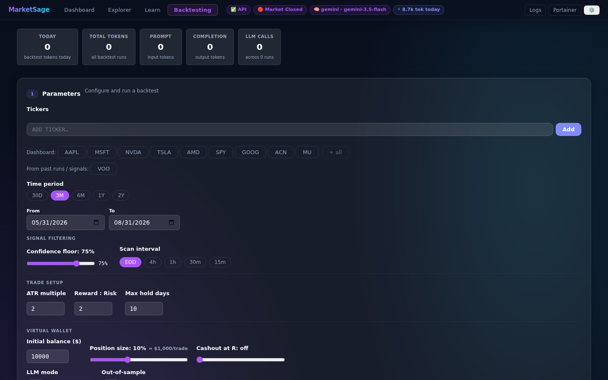

# Backtesting — Feature Reference



> **New to backtesting?** Read [backtesting-explained.md](backtesting-explained.md) first for concepts and metrics in plain English.

---

## Overview

The Backtesting tab replays the live signal-detection pipeline against historical OHLCV data — without look-ahead — and evaluates whether each signal's stop or target was hit first. Results are stored in the database and visualised with a confidence-floor sweep, a cumulative R-multiple curve, per-ticker breakdown, and a trade list.

---

## Parameters

| Parameter | Default | Description |
|---|---|---|
| **Tickers** | — | One or more symbols (add from watchlist or type manually) |
| **Start / End date** | — | Date range; presets: 3M / 6M / 1Y / 2Y |
| **Confidence floor** | 75% | Minimum signal confidence to include; drag slider post-run to re-filter with no re-run |
| **Max hold days** | 10 | Force-close a trade after N calendar days if neither stop nor target hit |
| **LLM mode** | off | Run AI analysis on each day (slower; subject to provider quotas) |
| **ATR multiple** | 2.0 | Stop distance = ATR\_multiple × ATR(14) |
| **Reward:Risk** | 2.0 | Target distance = reward\_risk × stop\_distance |
| **Position size** | 10% | Fraction of current balance deployed per trade in the virtual wallet simulation |
| **Cashout at R** | disabled | If set, exit a trade when unrealised profit reaches this R level (e.g. 1.5 exits when up 1.5 × risk); leave blank to always wait for target or stop |
| **Scan interval** | EOD | Candle interval for signal detection: EOD / 4h / 1h / 30m / 15m |
| **Requests/min** | no cap | Throttle LLM calls to stay within provider rate limits |
| **Initial balance** | $10,000 | Starting balance for the virtual wallet simulation |

---

## Virtual wallet

The virtual wallet simulation converts R-based results into actual dollar outcomes using fixed-fractional position sizing.

### Position sizing model

Each trade deploys **position\_size\_pct** (default 10%) of the current balance. The dollar amount *at risk* per trade is:

```
dollar_risk = balance × position_size_pct × (stop_distance / entry_price)
```

A win at +2R earns `2 × dollar_risk`; a loss earns `−1 × dollar_risk`; a cashout at 1.5R earns `1.5 × dollar_risk`.

### Dollar equity curve (Section 6b in results)

The results view includes a **$ portfolio equity curve** — the account balance plotted trade by trade. This shows the actual path of the account, including drawdown periods, not just the final number.

### Buy & hold benchmark overlay

The equity curve is overlaid with a **buy & hold** line: what the balance would be if you had bought the first ticker at the start of the window and held it to the end. If your strategy's curve finishes below the buy & hold line, passive holding would have been more profitable.

### Wallet column in past runs

Each row in the **Past runs** table includes a wallet summary:

```
$10,450 / +$450 (+4.5%) / 💰 3 cashouts
```

The three values are: final balance · dollar P&L (and percent) · number of cashout trades.

---

## Cashout rule

### How it works

When **Cashout at R** is set (e.g. 1.5), the engine monitors unrealised profit during the forward-walk. As soon as:

```
unrealised_R = (current_high − entry) / (entry − stop) ≥ cashout_r
```

the trade exits at `entry + cashout_r × (entry − stop)` and records outcome type **cashout** with `r_multiple = cashout_r`.

Without a cashout setting, trades can reach +1.8R unrealised and then reverse to −1.0R at the stop — cashout prevents that by locking in the gain early.

### Outcome type "cashout" in the trade list

Cashout trades are shown in **amber** in the trade list to distinguish them from clean wins. The `outcome` field value is `"cashout"`.

### Cashout count tile

The metrics section includes a **cashout count** tile showing how many trades exited via the cashout rule during the selected run.

---

## Saved configurations

### localStorage profiles

All parameter settings (except the date window) can be saved as a named profile in your browser's local storage. Profiles persist across page refreshes and browser sessions on the same device.

### What is saved

- Confidence floor, ATR multiple, Reward:Risk, Cashout at R
- Position size %, initial balance
- Max hold days, scan interval, LLM mode

The date window (start/end) is deliberately excluded — you pick fresh dates each time.

### Using profiles

- **Save:** enter a name and click Save. The profile appears in the list immediately.
- **Load:** click a profile name to populate all parameters at once.
- **Delete:** click × next to a profile name.

---

## Time-period note

yfinance returns ~730 calendar days of 1-hour data. For windows older than ~2 years from today:
- 1H and 4H indicators become `None`
- Only daily-bar rules fire
- A warning appears in the results

---

## LLM mode and quota management

When LLM mode is on, the engine calls `analyze()` for every ticker-day combination. Before you click **Run**, the **LLM Quota Estimate** card shows:

- **Est. requests** = tickers × approximate business days in the window
- **Est. tokens** = requests × average tokens/call (from your usage history)
- **Est. duration** = est. requests ÷ RPM cap
- **Daily-limit warning** if the estimate exceeds your provider's RPD or TPM

### Multi-provider fallback

If the primary provider returns a quota error (HTTP 429 / rate-limit) mid-run:
1. The engine automatically switches to the configured fallback provider
2. A `fallback` SSE event surfaces the switch as an inline notice
3. The run continues on the fallback provider

If **all** providers are exhausted:
1. The run stops early with status `stopped_quota`
2. All trades captured so far are saved and metrics computed over them
3. A `quota_stop` notice appears with the last ticker/day processed

Fallback provider and model are configured on the **Settings** page via `llm_fallback_provider` / `llm_fallback_model`. The same keys are used by the live scan path (Backlog item 3c).

---

## Signal capture and the confidence-floor sweep

The engine captures **all** detected signals at `floor = 0` (regardless of confidence). The confidence floor is then a *view filter*, not a capture gate:

- **Post-run**: drag the slider to any floor — metrics, trade list, and cumulative-R curve update instantly with no re-run.
- **Sweep chart**: win rate, avg R, and trade count vs floor (0–100 in steps of 5) so the optimal floor is visually obvious.

See [backtesting-explained.md § How to use the confidence-floor sweep](backtesting-explained.md#how-to-use-the-confidence-floor-sweep) for a step-by-step tuning workflow.

---

## Results view


After a run completes (or when loading a past run from the table), the Results view shows:

1. **Metric tiles** — win rate, avg R, Sharpe, max drawdown, false-positive rate, total trades, cashout count
2. **Confidence-floor slider** — drag to re-filter all cards and charts instantly; no re-run needed
3. **Floor sweep chart** — win-rate / avg-R / trade-count vs floor; find the optimal `CONFIDENCE_FLOOR` visually
4. **Cumulative R-multiple curve** — reflects the current slider floor
5. **AI Review button** — sends the run summary to the configured LLM for a plain-English critique
6. **Cumulative R equity curve** — running total R across all trades
6b. **$ portfolio equity curve** — account balance plotted trade by trade, with buy & hold overlay
7. **Per-ticker breakdown** — metrics split by symbol, including a $ P&L column
8. **Trade list** — every captured trade; rows below the current floor are dimmed; cashout trades shown in amber; includes $ P&L column

---

## Past runs table

All completed runs are listed in the **Past runs** table (most recent first).

- **Loaded run highlight** — the currently displayed run is shown with a blue row highlight
- **Persistence** — the last opened run is reloaded automatically when you refresh the page
- **Wallet column** — each row shows: final balance · dollar P&L (and %) · cashout count

### Example wallet column

```
$10,450 / +$450 (+4.5%) / 💰 3 cashouts
```

---

## Runs comparator

Select two or more past runs (checkboxes in the **Past runs** table) to open the comparator:

- **Enhanced metrics table** — for each run: period, signal mode, ATR × R:R, after-cost avg R (deducting estimated fee per trade), fee stress pass/fail, Sharpe, max drawdown, total trades, and wallet rows (final balance, P&L %)
- **Best-value highlighting** — the best value in each column is shown in green bold
- **Overlaid cumulative-R curves** — one coloured series per run on the same chart
- **$ portfolio equity chart overlay** — dollar equity curves for all selected runs on the same chart

The comparator fetches each run's full data via `GET /backtest/{id}` — no new endpoint.

Use the comparator to:
- Compare LLM-mode vs rule-mode on the same window
- Compare different ATR / reward:risk / cashout settings
- Compare different tickers on the same parameter set
- Compare in-sample vs out-of-sample runs

---

## API reference

All endpoints are prefixed `/api`.

### `POST /backtest/stream`

Start a backtest run. Returns a **Server-Sent Events** stream.

**Request body** (`application/json`):

```json
{
  "tickers": ["AAPL", "MSFT"],
  "start_date": "2024-01-01",
  "end_date": "2024-12-31",
  "initial_balance": 10000.0,
  "confidence_floor": 75,
  "max_hold_days": 10,
  "use_llm": false,
  "atr_multiple": 2.0,
  "reward_risk": 2.0,
  "position_size_pct": 0.10,
  "cashout_r": 1.5,
  "requests_per_minute": null
}
```

**SSE event types**:

| Type | Payload fields | Description |
|---|---|---|
| `progress` | `ticker`, `day`, `pct` | Per-ticker / per-day progress (0–100) |
| `fallback` | `from`, `to`, `reason` | Provider switched mid-run |
| `quota_stop` | `ticker`, `day`, `msg` | All providers exhausted; partial results saved |
| `result` | `run_id`, `report` | Run complete; full metrics + trades |
| `error` | `msg` | Unexpected engine error |

**Report structure** (inside `result.report`):

```json
{
  "run_id": 1,
  "metrics": {
    "win_rate": 0.55,
    "avg_r_multiple": 0.72,
    "sharpe": 1.1,
    "max_drawdown": 3.2,
    "false_positive_rate": 0.38,
    "total_trades": 47,
    "cashout_count": 3,
    "cashout_r": 1.5,
    "cumulative_r": [...],
    "per_ticker": [...],
    "floor_sweep": [
      {"floor": 0, "win_rate": 0.48, "avg_r_multiple": 0.3, "total_trades": 120},
      ...
    ],
    "wallet": {
      "initial_balance": 10000,
      "position_size": 1000,
      "position_size_pct": 0.10,
      "final_equity": 10450,
      "total_pnl": 450,
      "total_return_pct": 4.5,
      "peak_equity": 11200,
      "dollar_equity_curve": [
        {"date": "2026-01-05", "equity": 10035},
        "..."
      ],
      "buy_and_hold": {
        "return_pct": 8.2,
        "final_equity": 10820,
        "daily_equity_curve": [...]
      }
    }
  },
  "trades": [
    {
      "id": 1, "ticker": "AAPL", "signal_date": "2024-03-15",
      "type": "long", "confidence": 72.0, "source": "rule:rsi_oversold",
      "entry": 171.50, "stop": 168.20, "target": 178.10,
      "exit_date": "2024-03-18", "exit_price": 178.10,
      "outcome": "win", "r_multiple": 2.0,
      "reasons": ["RSI < 30", "MACD crossover"]
    },
    {
      "id": 2, "ticker": "AAPL", "signal_date": "2024-04-02",
      "type": "long", "confidence": 78.0, "source": "rule:macd_crossover",
      "entry": 170.00, "stop": 167.00, "target": 176.00,
      "exit_date": "2024-04-05", "exit_price": 175.50,
      "outcome": "cashout", "r_multiple": 1.5,
      "reasons": ["MACD bullish crossover"]
    }
  ],
  "warnings": []
}
```

---

### `GET /backtest`

List all past runs (most recent first). No authentication required.

**Response:**
```json
{
  "runs": [
    {
      "id": 1,
      "created_at": "2024-08-01T14:32:00",
      "tickers": ["AAPL", "MSFT"],
      "start_date": "2024-01-01",
      "end_date": "2024-12-31",
      "signal_mode": "rules",
      "status": "done",
      "confidence_floor": 75,
      "metrics": { ... }
    }
  ]
}
```

---

### `GET /backtest/{run_id}`

Fetch a specific run including all its trades.

**Response:** same shape as `result.report` above, plus the top-level run metadata.

**404** if the run does not exist.

---

### `DELETE /backtest/{run_id}`

Delete a run and all its trades (cascades).

**Response:** `{"deleted": true}` or **404** if not found.

---

## Database schema

```sql
CREATE TABLE backtest_runs (
    id INTEGER PRIMARY KEY AUTOINCREMENT,
    created_at TEXT NOT NULL,
    tickers TEXT NOT NULL,                -- JSON array
    start_date TEXT NOT NULL,
    end_date TEXT NOT NULL,
    initial_balance REAL NOT NULL DEFAULT 10000.0,
    confidence_floor REAL,
    max_hold_days INTEGER NOT NULL DEFAULT 10,
    signal_mode TEXT NOT NULL DEFAULT 'rules',  -- 'rules' | 'llm'
    atr_multiple REAL NOT NULL DEFAULT 2.0,
    reward_risk REAL NOT NULL DEFAULT 2.0,
    position_size_pct REAL NOT NULL DEFAULT 0.10,
    cashout_r REAL,                              -- null = disabled
    requests_per_minute INTEGER,
    status TEXT NOT NULL DEFAULT 'running',     -- running|done|error|stopped_quota
    metrics_json TEXT,
    error TEXT,
    llm_calls INTEGER NOT NULL DEFAULT 0,
    llm_prompt_tokens INTEGER NOT NULL DEFAULT 0,
    llm_completion_tokens INTEGER NOT NULL DEFAULT 0,
    llm_provider TEXT,                    -- null for rule mode
    llm_model TEXT,                       -- null for rule mode
    review_prompt_tokens INTEGER NOT NULL DEFAULT 0,      -- AI Review tokens
    review_completion_tokens INTEGER NOT NULL DEFAULT 0
);

CREATE TABLE backtest_trades (
    id INTEGER PRIMARY KEY AUTOINCREMENT,
    run_id INTEGER NOT NULL REFERENCES backtest_runs(id) ON DELETE CASCADE,
    ticker TEXT NOT NULL,
    signal_date TEXT NOT NULL,
    type TEXT NOT NULL,             -- long|short
    confidence REAL NOT NULL,
    source TEXT,
    entry REAL, stop REAL, target REAL,
    exit_date TEXT, exit_price REAL,
    outcome TEXT,                   -- win|loss|timeout|cashout
    r_multiple REAL,
    reasons TEXT,                   -- JSON array
    created_at TEXT NOT NULL
);
```

---

## LLM token tracking

All LLM-mode token usage from backtest runs flows into the **AI Usage** settings section:

| Source tag | What it counts |
|---|---|
| `backtest` | Tokens used during the backtest engine's day-by-day LLM calls |
| `backtest_review` | Tokens used by the **Get AI Review** button on a completed run |

Both are stored in `backtest_runs.llm_prompt_tokens` / `llm_completion_tokens` (engine calls) and `review_prompt_tokens` / `review_completion_tokens` (AI Review), and surfaced separately in **Settings → AI Usage → By-source cards**.

The **Past runs** table shows per-run **Tokens** and **LLM calls** columns, plus the **Model** used (provider · model name), so you can compare LLM cost across runs.

---

## AI Review

After a run completes, click **Get AI Review** (in the Metrics section) to send the run's summary — win rate, Sharpe, R-multiple distribution, per-ticker breakdown — to the configured LLM for a plain-English critique.

- Token usage is tracked separately from run tokens and shown inline (`N tok`)
- Persisted to `backtest_runs.review_prompt_tokens` / `review_completion_tokens`
- Counted as `backtest_review` source in **AI Usage**

---

## Outcome types

| Outcome | When it fires | Trade list colour |
|---|---|---|
| `win` | High ≥ target price before Low ≤ stop | default |
| `loss` | Low ≤ stop price before High ≥ target | default |
| `timeout` | Neither target nor stop hit within `max_hold_days`; exits at the day-N close | default |
| `cashout` | Unrealised profit reached `cashout_r × risk`; exits immediately at that level | amber |

If the high and low of a single bar breach both target and stop, the engine applies a conservative tie-break: the loss is counted (stop filled first). This reflects the real-world behaviour of gap-down / gap-up sessions.

---

## Architecture notes

- **Pure pipeline replay**: `analyze()` and `detect_opportunities()` are pure over a `market_data` dict — they fetch nothing, making date-sliced replay trivial.
- **As-of indicators**: `_indicators_from_df(df)` reads only the last bar; slicing `df.loc[:date]` gives point-in-time indicators.
- **ATR bracket synthesis**: `synthesize_bracket()` in `backend/backtest.py`; uses `ta.volatility.AverageTrueRange`.
- **Floor sweep cost**: cheap — `compute_metrics` iterates the stored per-signal list 21 times (one per 5-point step from 0 to 100), no OHLCV re-download.
- **Concurrency**: the engine runs in `asyncio.to_thread` so the FastAPI event loop stays unblocked; throttle sleep inside the thread is fine.
- **Model attribution**: `llm_provider` and `llm_model` are resolved at run start — DB setting first, then provider-specific env var (`GROQ_MODEL`, `GEMINI_MODEL`, etc.), then `LLM_MODEL` — so the runs table always shows the actual model used.
- **Token source unification**: `GET /usage` UNIONs `analysis_log` (live scans) + two slices of `backtest_runs` (engine + review) so AI Usage reflects total real spend across all surfaces.

---

*See also: [backtesting-explained.md](backtesting-explained.md) — concepts and metrics in plain English*
*Related: [how-signals-work.md](how-signals-work.md) — the live signal pipeline that backtesting replays*
