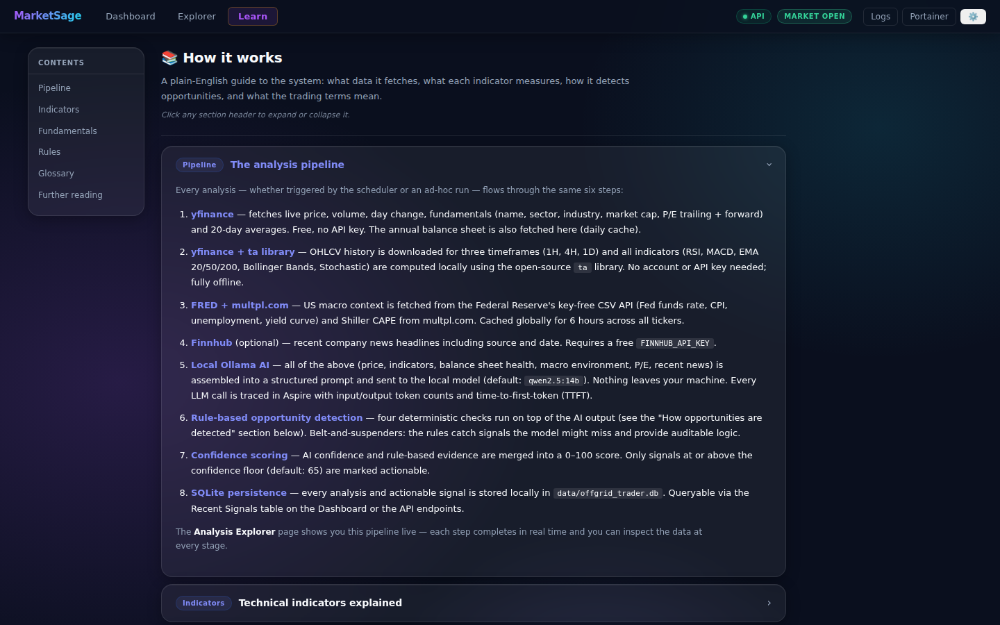
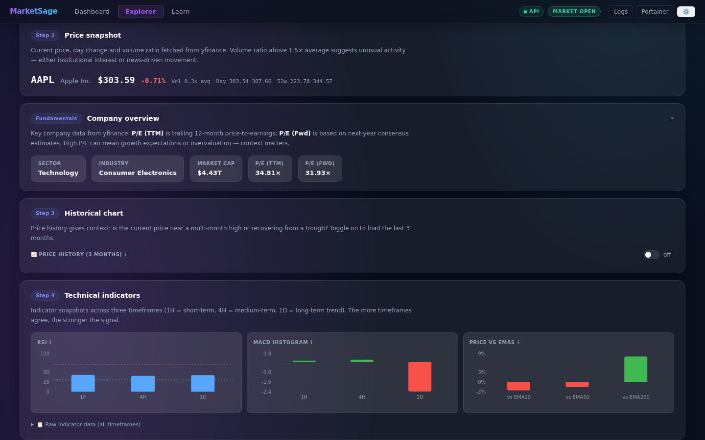
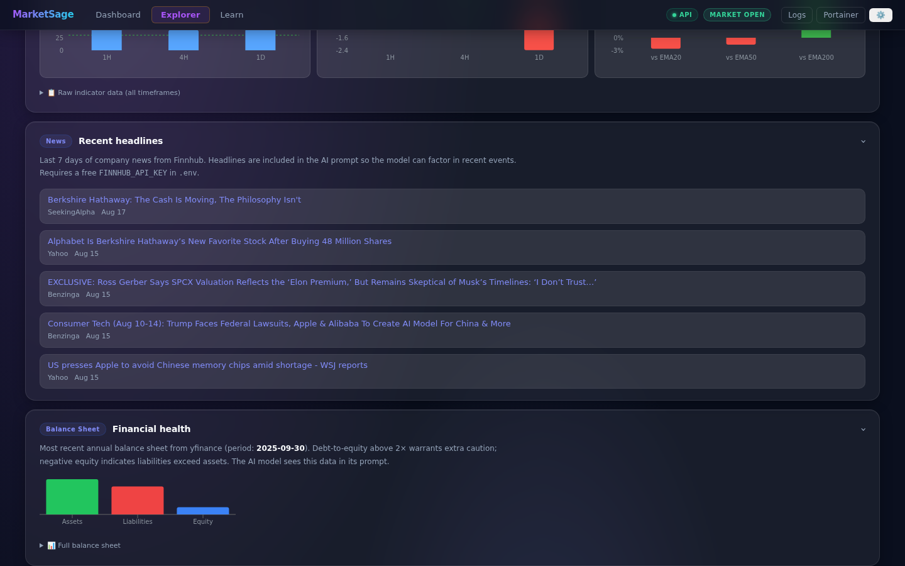

# Technical Indicators & Data Reference

This page explains every indicator and data point the system fetches, how it is
computed, and how it is used in the pipeline.
The same content is available in-app on the **Learn** tab — click any section header to expand it.

---

## How technical indicators are computed

OHLCV history is downloaded from **yfinance** and processed locally by the
open-source **`ta`** library (no API key, no rate limits, MIT licence).

| Timeframe | Download | Bars available | Use |
|---|---|---|---|
| 1H | `period="1y", interval="1h"` | ~1 638 bars | Short-term momentum, noise-sensitive |
| 4H | Resampled from the 1H download | ~410 bars | Medium-term trend confirmation |
| 1D | `period="2y", interval="1d"` | ~504 bars | Long-term context, most reliable for swing signals |

All three timeframes cover enough history for EMA200 (needs 200 bars). Agreement
across multiple timeframes is a much stronger signal than a single reading.

---

## RSI — Relative Strength Index

**Scale:** 0 → 100

Measures the speed and magnitude of recent price changes. Calculated as the ratio of
average gains to average losses over the last 14 periods.

| Value | Interpretation |
|---|---|
| **< 30** | **Oversold** — price fell fast; selling may be exhausted; potential bounce |
| 30–70 | Neutral — no extreme reading |
| **> 70** | **Overbought** — price rose fast; buying may be exhausted; potential pullback |

> **What the system checks:** RSI extreme (< 30 or > 70) on **2 or more** of the three
> timeframes simultaneously. Single-timeframe extremes are ignored — they are too
> common to be meaningful on their own.

---

## MACD — Moving Average Convergence/Divergence

**Three components:** MACD line · Signal line · Histogram

- **MACD line** = 12-period EMA − 26-period EMA
- **Signal line** = 9-period EMA of the MACD line
- **Histogram** = MACD − Signal (this is what the chart plots)

| Histogram | Interpretation |
|---|---|
| **Positive and rising** | Upward momentum building |
| **Positive and falling** | Upward momentum weakening |
| **Negative and falling** | Downward momentum building |
| **Crossing zero upward** | Bullish momentum shift |
| **Crossing zero downward** | Bearish momentum shift |

> **What the system checks:** MACD line above its signal line on **both** 1D and 4H
> (bullish crossover). MACD below signal on both (bearish). Requiring both timeframes
> filters out short-term whipsaws.

---

## EMA — Exponential Moving Average

**Three periods:** EMA 20 · EMA 50 · EMA 200

A weighted moving average that gives more weight to recent prices, so it reacts faster
than a simple moving average (SMA).

| Relationship | Interpretation |
|---|---|
| Price > EMA | Bullish — price trading above its average |
| Price < EMA | Bearish — price trading below its average |
| EMA 50 > EMA 200 | **Golden Cross** — long-term bullish signal; widely watched by institutions |
| EMA 50 < EMA 200 | **Death Cross** — long-term bearish signal |
| EMA 20 > EMA 50 | Short-term uptrend within the medium-term trend |

> **What the system uses:** EMA values are included in the AI prompt. The Explorer
> charts show `(price − EMA) / EMA × 100` — positive = price above EMA (green),
> negative = price below (red).

---

## Bollinger Bands

**Three bands:** Upper · Middle (MA 20) · Lower

The middle band is a 20-period simple moving average. Upper and lower bands are
±2 standard deviations from the middle. They widen in volatile markets and contract
in quiet ones.

| Condition | Interpretation |
|---|---|
| Price touching upper band | Potentially overbought; may pull back to middle |
| Price touching lower band | Potentially oversold; may bounce to middle |
| **Band squeeze** (bands narrow) | Volatility compression; breakout often follows |
| Band expansion after squeeze | Confirms a new trending move has begun |

> **What the system uses:** BB values are included in the AI prompt and visible in
> the collapsible indicator table. Not used in the current rule-based detection logic.

---

## Stochastic K% / D%

**Scale:** 0 → 100

Compares the current closing price to the high-low range over the last 14 periods.

- **%K** = (Close − Lowest Low) / (Highest High − Lowest Low) × 100
- **%D** = 3-period SMA of %K (smoothing)

| Value | Interpretation |
|---|---|
| **< 20** | Oversold (similar to RSI < 30) |
| **> 80** | Overbought (similar to RSI > 70) |
| %K crossing above %D | Bullish signal |
| %K crossing below %D | Bearish signal |

> **What the system uses:** Stochastic values are included in the AI prompt and
> visible in the indicator table. Not used in the current rule-based detection.

---

## Volume Ratio

**Formula:** current session volume ÷ 20-day average volume

Raw volume numbers vary enormously between stocks (AAPL trades billions of shares;
small-caps trade thousands). The ratio normalises volume so any stock can be compared
on the same scale.

| Ratio | Interpretation |
|---|---|
| **> 2×** | Very unusual — major news, earnings, or institutional order flow |
| **1.5–2×** | Elevated — worth noting |
| **≈ 1×** | Normal trading session |
| **< 0.5×** | Thin volume — any price move is low-conviction |

> **What the system checks:** Volume ≥ `VOLUME_SPIKE_MULTIPLIER` × average (default: 2.0×)
> **AND** day price move ≥ `SIGNIFICANT_MOVE_PCT` (default: 2%). Both thresholds are
> configurable in `.env`.

---

## Recommendation signal

Each timeframe carries a locally-computed `recommendation` string derived from a
4-signal symmetric vote:

| Signal | Bullish (+1) | Bearish (−1) |
|---|---|---|
| RSI | > 60 | < 40 |
| MACD histogram | positive | negative |
| Close vs EMA 20 | close > EMA20 | close < EMA20 |
| Close vs EMA 50 | close > EMA50 | close < EMA50 |

Score ≥ 2 → `BUY` · Score ≤ −2 → `SELL` · Otherwise → `NEUTRAL`

This is passed to the AI as additional context but not used directly in rule-based detection.

---

## Company Fundamentals

Fetched from **yfinance** alongside the price snapshot.

| Field | Description |
|---|---|
| **Name / Sector / Industry** | Company metadata for context |
| **Market Cap** | Total market value of outstanding shares |
| **Trailing P/E (TTM)** | Price ÷ actual earnings per share over the last 12 months. High P/E = expensive relative to current earnings; context varies by sector. |
| **Forward P/E** | Price ÷ consensus analyst EPS estimate for the next 12 months. Lower than trailing P/E implies expected earnings growth. |

> **What the system checks (valuation rule):** TTM P/E > 60 fires a low-confidence
> short flag (severely overvalued). 0 < P/E < 8 fires a low-confidence long flag
> (deeply discounted). Confidence is intentionally low (40–42); designed to reinforce,
> not drive, a signal.

---

## Balance Sheet

Fetched from **yfinance** annual filings; cached daily per ticker.

| Field | Description |
|---|---|
| **Period** | Balance sheet date (e.g. `2026-03-31`) |
| **Total Assets** | Everything the company owns or is owed |
| **Total Liabilities** | Everything the company owes |
| **Stockholders Equity** | Assets − Liabilities; the book value attributable to shareholders |
| **Total Debt** | Short-term + long-term borrowings |
| **Cash & Equivalents** | Liquid reserves |
| **Debt-to-Equity (D/E)** | Total Debt ÷ Stockholders Equity. Measures leverage. > 3 is considered highly leveraged; varies significantly by industry. |

> **What the system uses:** All balance sheet fields are included in the AI prompt.
> The D/E ratio is shown as a tile in the Explorer's Balance Sheet card.

---

## US Macro Indicators

Fetched from **FRED** (Federal Reserve Economic Data) key-free CSV endpoint, with
the Shiller CAPE from **multpl.com**. Globally cached for 6 hours in the DB — one
fetch serves all tickers in a scan cycle.

| Indicator | Source | Description |
|---|---|---|
| **Fed Funds Rate** | FRED `FEDFUNDS` | The US Federal Reserve's benchmark overnight lending rate. High rates raise borrowing costs and compress valuation multiples. |
| **CPI YoY** | FRED `CPIAUCSL` | Year-over-year change in the Consumer Price Index. The Fed targets 2%. High CPI forces rate rises that pressure equity multiples. |
| **Unemployment** | FRED `UNRATE` | US unemployment rate. Context indicator: very low unemployment (< 4%) can indicate an overheating economy. |
| **10y-2y Yield Spread** | FRED `T10Y2Y` | 10-year Treasury yield minus 2-year Treasury yield. **Negative = yield curve inverted** — a historically reliable recession precursor. |
| **Shiller CAPE** | multpl.com | Cyclically Adjusted P/E Ratio (10-year inflation-adjusted earnings). > 30 indicates elevated market-wide valuation; < 15 is historically cheap. |

> **What the system checks (macro regime filter):** After candidate signals are merged,
> their confidence scores are adjusted:
>
> | Condition | Long candidates | Short candidates |
> |---|---|---|
> | Yield curve inverted | −8 confidence | +3 confidence |
> | CAPE > 35 | −5 confidence | +3 confidence |
> | CAPE < 15 | +5 confidence | −3 confidence |
> | CPI YoY > 5% | −5 confidence | no change |

> ⚠ **If macro data shows all `—`:** FRED's key-free CSV endpoint
> (`fred.stlouisfed.org`) is sometimes blocked from Docker containers behind corporate
> VPNs. Set `FRED_API_KEY` in `.env` to use the more reliable REST API
> (`api.stlouisfed.org`). Get a free key at https://fred.stlouisfed.org/docs/api/api_key.html

---

## News Headlines

Fetched from **Finnhub** (optional). Requires a free `FINNHUB_API_KEY` in `.env`.

- Returns up to 5 recent headlines (last 7 days) per ticker
- Each headline includes: title, source, URL, and datetime
- Injected into the AI prompt as a `RECENT NEWS HEADLINES` block
- The AI uses them for qualitative context (earnings, guidance, litigation, etc.)

Without a Finnhub key the news block is empty — the system still works but the AI prompt contains no news context.

---

## Further reading

- [RSI — Investopedia](https://www.investopedia.com/terms/r/rsi.asp)
- [MACD — Investopedia](https://www.investopedia.com/terms/m/macd.asp)
- [EMA — Investopedia](https://www.investopedia.com/terms/e/ema.asp)
- [Bollinger Bands — Investopedia](https://www.investopedia.com/terms/b/bollingerbands.asp)
- [Stochastic Oscillator — Investopedia](https://www.investopedia.com/terms/s/stochasticoscillator.asp)
- [Shiller CAPE — Investopedia](https://www.investopedia.com/terms/s/schiller-pe-ratio.asp)
- [Yield Curve Inversion — Investopedia](https://www.investopedia.com/terms/i/invertedyieldcurve.asp)
- [FRED API documentation](https://fred.stlouisfed.org/docs/api/fred/)
