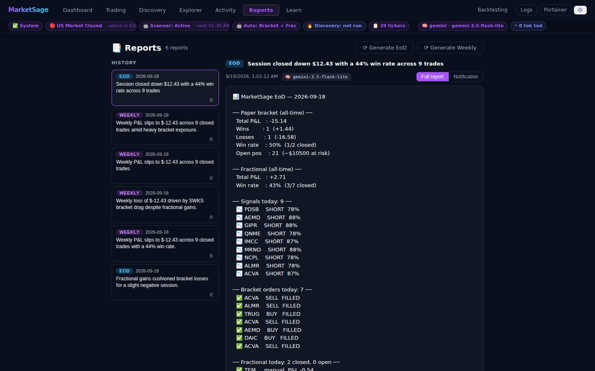

# Reports — EoD & Weekly

MarketSage generates **end-of-day** and **weekly** performance reports that combine
deterministic account figures with an LLM analyst narrative. Reports are persisted,
browsable in-app on the **📑 Reports** tab, and delivered to your notification
channels (ntfy + Telegram).

> ⚠️ **Not financial advice.** Reports summarise a paper-trading account for
> educational use only.

---

## What a report contains

Every report is built **compute-then-narrate**: all numbers are computed in Python
(the model never does arithmetic), then the LLM writes the prose around them. A single
LLM call produces two versions, stored separately:

- **Notification version** — a short, phone-sized summary sent to ntfy / Telegram.
- **Full version** — the deterministic digest (bracket + fractional economics,
  the period's signals, orders, and fractional exits) followed by an **AI analysis**
  block: commentary, observed patterns, concrete suggestions, and **parameter-tuning
  recommendations**.

### Parameter-tuning recommendations

The analyst is given the current effective value of every tunable knob
(`RSI_OVERSOLD`, `RSI_OVERBOUGHT`, `VOLUME_SPIKE_MULTIPLIER`, `SIGNIFICANT_MOVE_PCT`,
`CONFIDENCE_FLOOR`, `FRAC_MIN_CONFIDENCE`, `PAPER_TRADE_MIN_CONFIDENCE`,
`PAPER_MAX_POSITIONS`, `SIGNAL_DROP_MODE`, `DISCOVERY_MIN_SCORE`,
`DISCOVERY_AUTOADD_ENABLED`, `DISCOVERY_AUTOADD_TOP_N`). Each recommendation is a
`setting → suggested value` pair with a one-line rationale tied to the session's
data. The model is instructed to suggest changes only when the data justifies them
and never to echo the current value. See [Settings](settings.md) and
[Paper Trading § Autonomous trading](paper-trading.md#autonomous-trading) for the
knobs themselves.

### Model tag

Each report records which LLM generated it (e.g. `gemini-3.5-flash-lite`). It appears
as a 🧠 chip in the Reports viewer and as a `— generated by <model>` line at the
bottom of the full body.

### Graceful degradation

On any LLM or parse failure the report still sends: it falls back to the raw
deterministic digest with an `⚠️ AI analysis unavailable` note, and is stored with
`llm = false` (shown as a ⚠️ marker in the history list). A failure also logs a
`report`-category error to the [Activity feed](observability.md#activity-feed-in-app-event-log).

---

## The Reports page

Open the **📑 Reports** tab from the top nav:

- **History list** (left) — every persisted report, newest first, with a type chip
  (EoD / Weekly), date, headline, and a ⚠️ marker if AI analysis was unavailable.
  Each row has a 🗑 delete button.
- **Viewer** (right) — the selected report with a **Full report / Notification**
  toggle and the 🧠 model chip.
- **Generate buttons** — `⟳ Generate EoD` and `⟳ Generate Weekly` trigger a report
  on demand (async, with a loading state) and jump to the freshly-created report.



---

## Externalised prompts

The analyst prompts live as editable files, not inline strings:

- `backend/prompts/report_eod.md`
- `backend/prompts/report_weekly.md`

Both use `{{TOKEN}}` placeholders (headline metrics, the JSON session snapshot, and
the current `{{TUNING_CONFIG}}`) and return a fixed compact-JSON shape
(`headline`, `notification`, `commentary`, `patterns`, `suggestions`, `tuning`).
Edit them to change tone or emphasis without touching code.

---

## API

| Endpoint | Purpose |
|---|---|
| `GET /reports/eod` | Generate + dispatch the end-of-day report; persists and returns it. Returns **502** if no channel is configured (so an external cron can't silently deliver nothing). |
| `GET /reports/llm-summary?period=daily\|weekly` | Generate + dispatch a daily or weekly LLM summary. |
| `GET /reports?limit=&type=` | List persisted reports (newest first); `type` filters `eod\|weekly\|daily`. |
| `DELETE /reports/{id}` | Delete a persisted report. |

```bash
# Trigger on demand (same calls the Cloudflare cron makes):
curl -H "Authorization: Bearer <ADMIN_TOKEN>" "https://<your-backend>/reports/eod"
curl -H "Authorization: Bearer <ADMIN_TOKEN>" "https://<your-backend>/reports/llm-summary?period=weekly"
```

Reports are meant to be triggered on a schedule by the
[Cloudflare Workers cron](cloudflare-cron.md); they can also be generated manually
from the Reports page. Delivery details (channels, `<pre>` Telegram rendering) are in
[Notifications § Periodic reports](notifications.md#periodic-reports--eod-digest--llm-summary).
