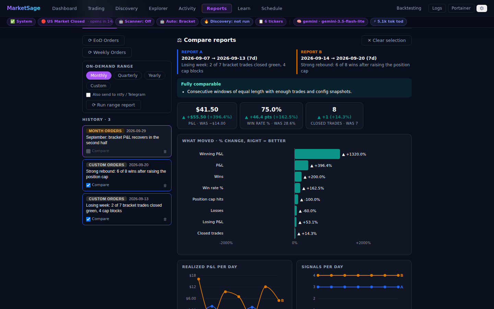

# Reports — focused types, on-demand ranges, and report comparison

MarketSage generates **4 focused report types** — one EoD and one weekly each for
fractional trades and bracket orders — that combine deterministic account figures with
an LLM analyst narrative. Reports are persisted, browsable in-app on the **📑 Reports**
tab (split into Frac / Orders tabs), and delivered to your notification channels
(ntfy + Telegram).

> ⚠️ **Not financial advice.** Reports summarise a paper-trading account for
> educational use only.

---

## Report types

| `report_type` | Trigger | Data scope |
|---|---|---|
| `eod_orders` | `GET /reports/eod/orders` | Today's bracket (paper) orders + cap hits |
| `weekly_orders` | `GET /reports/weekly/orders` | 7-day bracket history + cross-week patterns |
| `eod_frac` | `GET /reports/eod/frac` | Today's fractional trades + budget cap hits |
| `weekly_frac` | `GET /reports/weekly/frac` | 7-day frac history + cross-week patterns |
| `monthly_*` · `quarterly_*` · `yearly_*` | `GET /reports/range?period=…&mode=…` | Last 30 / 90 / 365 days, on demand |
| `custom_*` | `GET /reports/range?start=…&end=…&mode=…` | Any explicit date range (up to 3 years), on demand |

`*` is `orders` or `frac`, so e.g. `quarterly_frac` or `custom_orders`.

Legacy types (`eod`, `daily`, `weekly`) remain in the DB and appear in the Orders tab.

---

## What a report contains

Every report is **compute-then-narrate**: numbers are computed in Python (the LLM
never does arithmetic), then the model writes prose. One LLM call produces two
versions, both stored:

- **Notification** — a short, phone-sized summary for ntfy / Telegram, including the
  single most actionable insight.
- **Full report** — the deterministic digest followed by an **AI analysis** block:
  commentary, observed patterns, concrete suggestions, and parameter-tuning
  recommendations.

### Missed-opportunity diagnostics (key feature)

When the position cap (`PAPER_MAX_POSITIONS`) or budget cap (`FRAC_BUDGET`) is
reached during a scan, the system now **persists a `order_blocked` event** to the
activity log. These events are counted and passed to the LLM so every report can say:

> "12 orders were blocked by the position cap this week — consider raising
> `PAPER_MAX_POSITIONS` from 5 to 8."

If cap hits occurred, the full report shows an **⚠️ yellow banner** above the
commentary, and the tuning block always includes a fix recommendation.

### Cross-week patterns (weekly reports only)

Weekly reports analyse patterns that a single day can't reveal:
- **Confidence drift** — is average signal confidence trending up or down?
- **Win/loss streaks** — are losses clustered by day or ticker?
- **Top/bottom performers** — which tickers had the best and worst realized P&L?
- **Signal recurrence** — which tickers appeared 3+ days in a row?
- **Stop vs target ratio** (orders) — are entries too aggressive?
- **Budget utilisation** (frac) — what % of `FRAC_BUDGET` was deployed?

### Parameter-tuning recommendations

The analyst receives every tunable knob and its current value. Frac reports reference
`FRAC_BUDGET`, `FRAC_POSITION_SIZE`, `FRAC_MIN_CONFIDENCE`, `FRAC_POLL_SECONDS`.
Orders reports reference `PAPER_MAX_POSITIONS`, `PAPER_TRADE_MIN_CONFIDENCE`,
`CONFIDENCE_FLOOR`, `RSI_OVERSOLD`, `RSI_OVERBOUGHT`, `VOLUME_SPIKE_MULTIPLIER`.
Each recommendation is a `setting → suggested value` pair with a one-line rationale
tied to the actual data. The model only suggests changes the data justifies, never
echoes the current value.

### Per-type model selection

Set a different LLM for each report type in **Settings → AI provider → Report models**
(leave blank to use the primary model). Useful for routing cheap/fast models to EoD
reports and a premium model (e.g. `mistral-large-latest`) to weekly insights.

### Model tag

Each report records which LLM generated it. It appears as a 🧠 chip in the viewer
and as `— generated by <model>` at the bottom of the full body.

### Graceful degradation

On LLM/parse failure the report still sends: it falls back to the raw deterministic
digest with `⚠️ AI analysis unavailable`, stored with `llm = false`.

---

## The Reports page

Open **📑 Reports** from the top nav. The page has two tabs:

- **📋 Orders** — `eod_orders`, `weekly_orders`, the `*_orders` range reports, and legacy reports.
- **🔢 Fractional** — `eod_frac`, `weekly_frac`, and the `*_frac` range reports.

Each tab has:
- **Generate buttons** — `⟳ EoD <mode>` and `⟳ Weekly <mode>` (async, with loading
  state); jump to the fresh report on completion.
- **On-demand range** — Monthly / Quarterly / Yearly / Custom presets with date pickers
  and an optional *Also send to ntfy / Telegram* toggle (see below).
- **History list** — newest first, with a colour-coded type chip, date, headline, ⚠️
  marker if AI was unavailable, a **Compare** checkbox, and a 🗑 delete button.
- **Viewer** — Full report / Notification toggle, 🧠 model chip, yellow ⚠️ banner if
  cap hits occurred, **Copy** button (copies full text to clipboard). Replaced by the
  comparison panel while two reports are ticked.

---

## On-demand range reports

Besides the scheduled EoD and weekly reports, you can run a report over any window:

- **Monthly / Quarterly / Yearly** — the last 30 / 90 / 365 days up to today.
- **Custom** — any inclusive start and end date. The end can't be in the future and the
  span is capped at 3 years.

Range reports are **on demand only** — no cron runs them, because the Cloudflare free
plan's five cron triggers are already in use. They also **don't notify** unless you tick
*Also send to ntfy / Telegram* (`notify=true` on the API).

Per-bucket breakdowns (`signals_by_day`, `bracket_by_day` / `frac_by_day`) adapt to the
window so a yearly report doesn't produce 365 points:

| Window | Bucket (`bucket_granularity`) |
|---|---|
| up to 31 days | day |
| up to 1 year | week (keyed by its Monday) |
| longer | month |

All range periods share two prompts — `report_range_orders.md` and
`report_range_frac.md` — and one model override, `llm_model_range`.

### What every report now stores

Each report's `context_json` also persists, so later comparisons are honest:

| Key | Meaning |
|---|---|
| `window` | `{start, end, days}` of the report's window |
| `window_economics` | P&L, win rate, trade counts **inside the window** (the `bracket_economics` / `frac_economics` blocks are all-time) |
| `tuning` | the tuning knobs in force when the report was generated, scoped to its flow |
| `mode` | `orders` or `frac` |

Report data is queried by date range in SQL, so long windows are never truncated. A
fractional position is counted in the window it **closed** in, so consecutive windows
never both count it.

---

## Comparing two reports



Tick **Compare** on two reports of the **same type** (for example two `weekly_orders`, or
two `custom_frac`) and the viewer becomes a comparison panel. Report **A** is always the
earlier one, and every delta is **B − A**. Reports of a different type are greyed out once
you've picked the first.

### Comparability grade

Before anything is shown, the backend grades how fair the comparison is. The LLM review
can never upgrade this grade.

| Grade | When |
|---|---|
| **Fully comparable** | Consecutive windows of equal length, ≥ 5 closed trades each, tuning snapshots on both |
| **Partially comparable** | Too few closed trades · windows overlap or aren't consecutive · a tuning snapshot is missing · signal volume differs by more than half |
| **Not comparable** | Window lengths differ by more than 20% · a report predates window-scoped metrics |

### Layer 1 — deterministic diff (no LLM)

- **Headline tiles** — P&L, win rate and closed trades for B, with the change from A.
- **What moved** — one bar per metric, % change, **right/teal = better, left/rose =
  worse**. Direction depends on whether higher is better: fewer losses or fewer blocked
  trades point right. Metrics with no good/bad direction (signals, open positions,
  notional) and metrics where A was zero stay in the table only.
- **Per-bucket overlay** — for multi-day reports, A (blue) and B (amber) P&L and signal
  counts drawn over the same bucket index (Day 1, Day 2, …) so the periods line up.
- **All metrics** — A, B, Δ and %Δ for every metric.
- **Configuration changes** — the tuning knobs that differed between the two reports.

Reports generated before this release have no tuning snapshot or window metrics, so their
comparisons are graded down and say so.

### Layer 2 — trading-master review (on demand)

**🧠 Get trading-master review** sends both reports' full snapshots, the Layer 1 diff and
the comparability grade to the LLM. The review returns:

- a verdict — improved / regressed / mixed / inconclusive — with a confidence level;
- **what's good**, and **what's bad** with a cause for each regression (a specific config
  change, or an explicit "no configuration change explains this");
- **what to improve** — setting, current → proposed value, rationale, expected effect and
  confidence;
- what to watch in the next report.

The prompt forbids causal claims from small samples or without tuning snapshots. Suggestions
are limited to the report's own flow: a frac comparison never suggests `PAPER_*` settings,
and anything out of scope is removed before it reaches you. A "Not comparable" pair always
comes back *inconclusive*. The review uses its own model override, `llm_model_report_compare`,
so you can point it at a stronger model. Tokens are tracked as **Report Compare** in
Settings → AI Usage.

---

## Externalised prompts

Analyst prompts live as editable files — change tone or emphasis without touching code:

| File | Used for |
|---|---|
| `backend/prompts/report_eod_orders.md` | EoD bracket report |
| `backend/prompts/report_weekly_orders.md` | Weekly bracket report (cross-week analysis) |
| `backend/prompts/report_eod_frac.md` | EoD fractional report |
| `backend/prompts/report_weekly_frac.md` | Weekly fractional report (cross-week analysis) |
| `backend/prompts/report_range_orders.md` | Monthly / quarterly / yearly / custom bracket report |
| `backend/prompts/report_range_frac.md` | Monthly / quarterly / yearly / custom fractional report |
| `backend/prompts/report_compare_system.md` + `report_compare_user.md` | Trading-master comparison review (JSON validated by `schemas/report_compare.schema.json`) |
| `backend/prompts/report_eod.md` | Unused — unreachable fallback default (see note) |
| `backend/prompts/report_weekly.md` | Unused — unreachable fallback default (see note) |

> The last two files are no longer loaded by any endpoint. They remain only as the
> `prompt_file is None` fallback inside `_compose_report`, and every caller now passes
> an explicit `report_{report_type}.md`, so that branch is never taken.

All use `{{TOKEN}}` placeholders and return a fixed JSON shape
(`headline`, `notification`, `commentary`, `patterns`, `suggestions`, `tuning`).

---

## Blocked-event logging

When a trade is wanted but blocked, the system saves an `order_blocked` event:

| Reason | Logged by | Meaning |
|---|---|---|
| `position_cap` | `PaperTradeSkill` | `PAPER_MAX_POSITIONS` was at the cap |
| `budget_cap` | `FracTradeSkill` | `FRAC_BUDGET` was exhausted |
| `insufficient_funds` | both skills | Alpaca rejected the order |
| `untradable_dropped` | `TradabilityGateSkill` | Signal dropped as permanently unactionable |

These events are visible in the [Activity feed](observability.md#activity-feed-in-app-event-log)
and counted into every report's `blocked_events` context.

Untradable drops are logged as `Dropped … signal` scan warnings rather than `order_blocked`
events, and they are counted two ways:

- `untradable_dropped` — every drop. The same ticker is re-detected on each scan, so this
  number grows quickly (one non-shortable ticker can be dropped 40+ times a week).
- `untradable_tickers` — distinct tickers dropped. This is the size of the real problem.

No setting turns an untradable signal into a trade, so the report prompts forbid tuning
suggestions for these drops (in particular any `SIGNAL_DROP_MODE` change). The useful
response is removing the tickers from the watchlist. Every prompt also shows each setting's
allowed values next to its current value, and the comparator review rejects an impossible
value such as `SIGNAL_DROP_MODE=none`.

---

## API

| Endpoint | Purpose |
|---|---|
| `GET /reports/eod/orders` | Generate + dispatch today's bracket orders report |
| `GET /reports/weekly/orders` | Generate + dispatch the 7-day bracket orders report |
| `GET /reports/eod/frac` | Generate + dispatch today's fractional report |
| `GET /reports/weekly/frac` | Generate + dispatch the 7-day fractional report |
| `GET /reports/range?mode=&period=` / `?mode=&start=&end=` | Generate an on-demand range report (`notify=true` to also dispatch) |
| `GET /reports/compare?a=&b=` | Deterministic diff + comparability grade for two same-type reports |
| `POST /reports/compare/review` | Trading-master LLM review; body `{"a": id, "b": id}` |
| `GET /reports?limit=&type=` | List persisted reports; `type` filters by `report_type` |
| `DELETE /reports/{id}` | Delete a persisted report |

> `GET /reports/eod` and `GET /reports/llm-summary` were **removed** when the reports
> were split into the four focused types above. Stored rows from those older runs
> (`report_type` of `eod`, `weekly` or `daily`) still list and display normally.

```bash
# Trigger on demand:
curl -H "Authorization: Bearer <ADMIN_TOKEN>" "https://<your-backend>/reports/eod/orders"
curl -H "Authorization: Bearer <ADMIN_TOKEN>" "https://<your-backend>/reports/weekly/frac"
```

Reports are meant to be triggered on a schedule by the
[Cloudflare Workers cron](cloudflare-cron.md); they can also be generated manually
from the Reports page. Delivery details are in
[Notifications § Periodic reports](notifications.md#periodic-reports).
