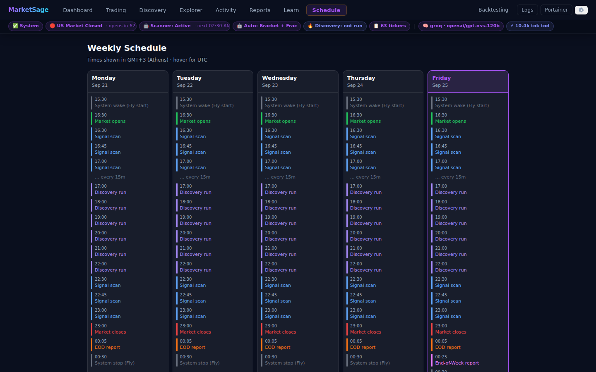

# Schedule

The **🗓 Schedule** page draws the whole trading week as a timeline, so you can see at a
glance when the machine wakes, when scans fire, and when each report goes out — without
reading cron expressions.

> ⚠️ **Not financial advice.** For educational and research use only.

---

## What it shows

Five columns, Monday to Friday, with today's column highlighted. Each column lists the
day's events in order:

| Event | Source |
|---|---|
| **System wake (Fly start)** | Cloudflare cron starts the Fly machine |
| **Market opens** | US market open (09:30 ET) |
| **Signal scan** | In-process scheduler, repeating every `scan_interval_minutes` |
| **Discovery run** | Trending-ticker discovery, hourly when enabled |
| **Market closes** | US market close (16:00 ET) |
| **EOD report** | `GET /reports/eod/orders` + `GET /reports/eod/frac` |
| **End-of-Week report** | Friday only — `GET /reports/weekly/orders` + `/weekly/frac` |
| **System stop (Fly)** | Cloudflare cron stops the Fly machine |

Because the scan interval is read live from `/settings`, changing it in
**Settings → Scheduler** immediately redraws the timeline.

---

## Time zones

Times render in **Europe/Athens** (the author's local zone) and each entry shows its
**UTC** equivalent on hover. The underlying schedule is anchored to US Eastern — the
market hours and the Cloudflare crons are both ET-based — so during the few weeks each
year when US and EU daylight-saving transitions are out of step, the displayed local
times shift by an hour while the ET times stay fixed.

---

## Relationship to the two schedulers

Two independent schedulers drive the events on this page, and it helps to know which
owns what:

- **Cloudflare Workers cron** — owns the machine lifecycle (wake/stop) and triggers the
  four report endpoints. It runs even while the Fly machine is stopped, which is what
  makes the wake possible. See [cloudflare-cron.md](cloudflare-cron.md).
- **In-process `MonitorScheduler`** — owns signal scans, discovery runs, paper-order
  sync, and fractional exit monitoring. It only runs while the machine is up, so its
  events are always bounded by the wake and stop times above.

A consequence worth remembering: if the machine never wakes, no scans happen *and* the
report endpoints fail, because they are served by the very app that is still stopped.

---

## Related

- [Cloudflare cron](cloudflare-cron.md) — the schedules themselves, and how to change them
- [Reports](reports.md) — what each of the four reports contains
- [Settings](settings.md) — scan interval and discovery cadence
