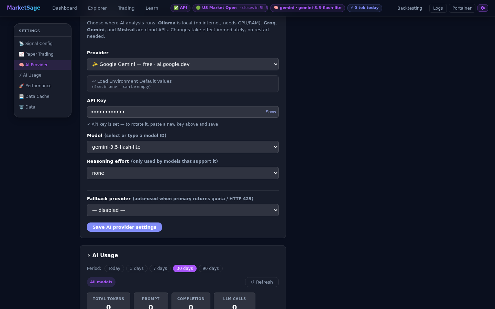
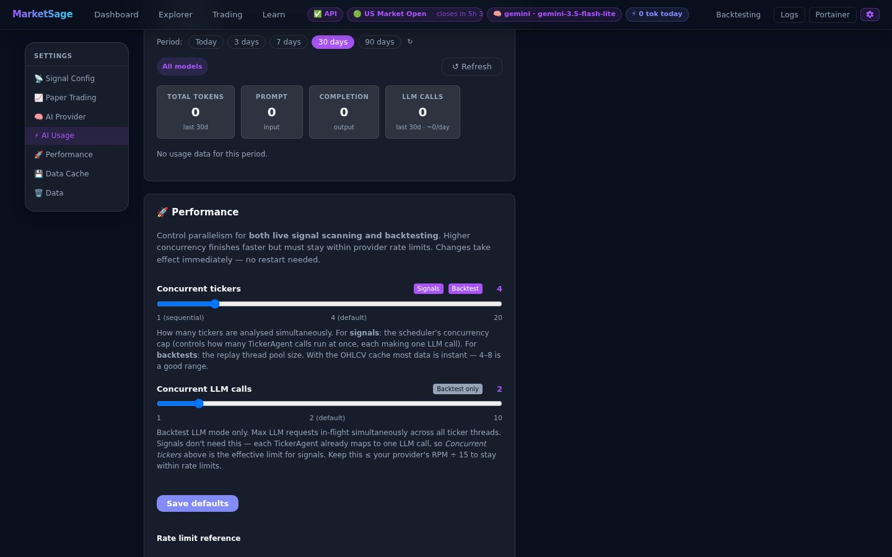
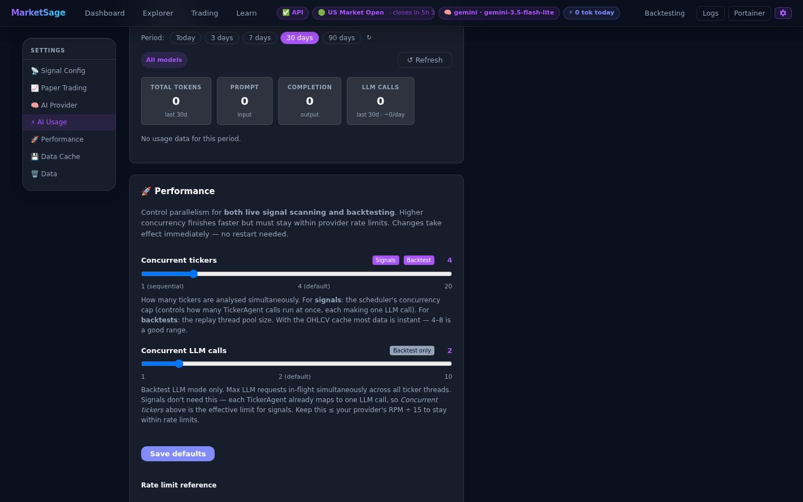

# Settings Reference



All configuration for **MarketSage** is driven by environment variables in `.env`
(copied from `.env.example`). Most can also be changed at **runtime** from the
**Settings page** (⚙ gear in the header) or via the API — no container restart needed.

> Runtime changes are persisted to SQLite (`app_settings` table) and survive restarts.
> `.env` values act as defaults; the DB value overrides them once set via the UI/API.

---

## Watchlist & scanning

| Variable | Default | Runtime-mutable | Description |
|---|---|---|---|
| `WATCHLIST` | `AAPL,MSFT,NVDA,TSLA,AMD,SPY` | ✓ (via Dashboard add/remove) | Comma-separated tickers to auto-scan. Add/remove from the Dashboard; changes persist to DB. |
| `SCAN_INTERVAL_MINUTES` | `15` | ✓ (Settings page or `POST /settings/scan-interval`) | Minutes between scans while the market is open. Takes effect on the next loop cycle. |
| `SCHEDULER_AUTO_START` | `false` | ✓ (Settings page toggle persists to DB) | Start auto-scan automatically on every container boot. Once toggled via the UI, the DB value takes precedence. |
| `DATABASE_PATH` | `offgrid_trader.db` | ✗ | Path to the SQLite database file. In Docker this is set to `/app/data/offgrid_trader.db` (bind-mounted). |

---

## AI Provider

> **Settings page → 🧠 AI Provider** — change provider and API key at runtime without restarting.
> See [cloud-llm.md](cloud-llm.md) for step-by-step free-tier setup (Groq, Gemini, Mistral).

The Settings page uses a left-hand menu for Scheduler, Alerts, AI Provider, and
Data. Changing the provider clears the current provider's API key, model, base
URL, `.env` toggle, and reasoning selection before loading the new provider's
options. This prevents, for example, a Gemini model from being saved for Mistral.

The model field is a free-text input with provider-specific suggestions. Choose
one from the dropdown or type any valid model ID; the empty suggestion means
"type your own model". For Ollama, suggestions include `qwen2.5:3b`,
`qwen2.5:7b`, and `qwen2.5:14b`.

For non-custom providers, **Use `.env` defaults** fills the key/model from the
environment-derived configuration and clears saved UI overrides when saved.

| Variable | Default | Runtime-mutable | Description |
|---|---|---|---|
| `LLM_PROVIDER` | `ollama` | ✓ (Settings page or `POST /settings/llm`) | Active provider: `ollama` / `groq` / `gemini` / `mistral` / `custom` |
| `GROQ_API_KEY` | *(unset)* | ✓ (Settings page) | API key from https://console.groq.com — no credit card. Stored in DB; never returned by the API. |
| `GROQ_MODEL` | `llama-3.3-70b-versatile` | ✓ (Settings page) | Groq model override (optional — leave blank for the default). |
| `GEMINI_API_KEY` | *(unset)* | ✓ (Settings page) | API key from https://aistudio.google.com — no billing required. |
| `GEMINI_MODEL` | `gemini-3.5-flash-lite` | ✓ (Settings page) | Gemini model override. |
| `GEMINI_BASE_URL` | `https://generativelanguage.googleapis.com/v1beta/openai/` | ✓ (Settings page) | Gemini's OpenAI-compatible endpoint. |
| `MISTRAL_API_KEY` | *(unset)* | ✓ (Settings page) | API key from https://console.mistral.ai. |
| `MISTRAL_MODEL` | `mistral-small-latest` | ✓ (Settings page) | Mistral model override. |
| `MISTRAL_BASE_URL` | `https://api.mistral.ai/v1` | ✓ (Settings page) | Mistral's OpenAI-compatible endpoint. |
| `LLM_BASE_URL` | *(unset)* | ✓ (Settings page) | Base URL for `custom` provider — any OpenAI-compatible endpoint. |
| `LLM_API_KEY` | *(unset)* | ✓ (Settings page) | API key for `custom` provider. |
| `LLM_MODEL` | *(unset)* | ✓ (Settings page) | Model name for `custom` provider. |
| `llm_reasoning_effort` (DB setting only) | `none` | ✓ (Settings page or `POST /settings/llm`) | Reasoning effort (`none`/`low`/`medium`/`high`) sent to Groq/Mistral always, and to Gemini only when non-default (Gemini 3.x rejects `none`). |
| `LLM_FALLBACK_PROVIDER` | *(unset)* | ✓ (Settings page or `POST /settings/llm`) | Provider to use automatically when the primary provider returns HTTP 429. Same values as `LLM_PROVIDER`. Leave blank to disable fallback. |
| `LLM_FALLBACK_MODEL` | *(unset)* | ✓ (Settings page or `POST /settings/llm`) | Model to use with the fallback provider. Leave blank to use that provider's default model. |
| `CLOUD_LLM_TIMEOUT` | `60` | ✗ | Seconds to wait for a cloud provider response. |

**`make infra` auto-skip:** when `LLM_PROVIDER ≠ ollama`, Ollama containers are skipped automatically (saves RAM/VRAM). Override: `bash infra/start-infra.sh --with-ollama`.

> **Security note:** `GET /settings` never returns the `admin_token` value (or any raw
> API key). API keys are stored in the DB and only exposed as boolean "is set" flags.
> See [Security](security.md) for the full auth design.

---

## Ollama (local LLM)

Used when `LLM_PROVIDER=ollama` (the default).

| Variable | Default | Runtime-mutable | Description |
|---|---|---|---|
| `OLLAMA_HOST` | `http://localhost:11434` | ✗ | Ollama server URL. In Docker: overridden to `http://ollama:11434` by Compose. |
| `OLLAMA_MODEL` | `qwen2.5:14b` | ✓ (Settings page or `POST /settings/ollama`) | Model tag. Must already be pulled in Ollama. Match to your GPU VRAM: `3b` ≈ 3 GB, `7b` ≈ 5 GB, `14b` ≈ 10 GB. |
| `OLLAMA_TIMEOUT` | `120` | ✓ (Settings page or `POST /settings/ollama`) | Seconds to wait for an Ollama response before failing. Increase for slow CPU inference. |

To pull a new model without restarting:
```bash
docker exec ollama ollama pull qwen2.5:14b
```

---

## Signal thresholds

| Variable | Default | Description |
|---|---|---|
| `RSI_OVERSOLD` | `30` | RSI below this on 2+ timeframes → long candidate |
| `RSI_OVERBOUGHT` | `70` | RSI above this on 2+ timeframes → short candidate |
| `VOLUME_SPIKE_MULTIPLIER` | `2.0` | Volume must be this many times the 20-day average to trigger volume-spike rule |
| `SIGNIFICANT_MOVE_PCT` | `2.0` | Day price move (%) required alongside a volume spike |
| `CONFIDENCE_FLOOR` | `65` | Minimum 0–100 confidence for a signal to be stored and alerted |

These are read-only from the UI — edit `.env` then `make up` to recreate the container.

---

## Alerts

| Variable | Default | Runtime-mutable | Description |
|---|---|---|---|
| `ALERTS_SEND_ENABLED` | `true` | ✓ (Settings page or `POST /settings/alerts`) | Global on/off for email + Slack. Telegram has its own flag. |
| `EMAIL_ENABLED` | `false` | ✗ | Enable Gmail SMTP alerts. Requires the SMTP vars below. |
| `SMTP_HOST` | `smtp.gmail.com` | ✗ | |
| `SMTP_PORT` | `587` | ✗ | |
| `SMTP_USERNAME` | *(unset)* | ✗ | Your Gmail address |
| `SMTP_APP_PASSWORD` | *(unset)* | ✗ | 16-character Gmail App Password (not your account password). Create at https://myaccount.google.com/apppasswords |
| `EMAIL_FROM` | *(unset)* | ✗ | Sender address |
| `EMAIL_TO` | *(unset)* | ✗ | Recipient address |
| `SLACK_ENABLED` | `false` | ✗ | Enable Slack Incoming Webhook alerts. |
| `SLACK_WEBHOOK_URL` | *(unset)* | ✗ | Incoming Webhook URL from https://api.slack.com/messaging/webhooks |
| `TELEGRAM_ENABLED` | `false` | ✗ | Enable Telegram bot alerts. |
| `TELEGRAM_BOT_TOKEN` | *(unset)* | ✗ | Token from @BotFather |
| `TELEGRAM_CHAT_ID` | *(unset)* | ✗ | Chat or group ID. Get it via `https://api.telegram.org/bot<TOKEN>/getUpdates` |

---

## Optional data sources

| Variable | Default | Description |
|---|---|---|
| `FINNHUB_API_KEY` | *(unset)* | Free key from https://finnhub.io — enables recent news headlines injected into the AI prompt (60 req/min on the free tier). Without a key, the news section of the prompt is empty. |
| `FRED_API_KEY` | *(unset)* | Free key from https://fred.stlouisfed.org/docs/api/api_key.html — enables the FRED REST API (`api.stlouisfed.org`) for macro data. Strongly recommended when running inside Docker behind a corporate VPN, where the key-free CSV endpoint (`fred.stlouisfed.org`) is often blocked. |

---

## Market hours

| Variable | Default | Description |
|---|---|---|
| `MARKET_TIMEZONE` | `America/New_York` | Timezone for market-hours checks |
| `MARKET_OPEN_HOUR` | `9` | Market open hour (24h, local timezone) |
| `MARKET_OPEN_MINUTE` | `30` | Market open minute |
| `MARKET_CLOSE_HOUR` | `16` | Market close hour |
| `MARKET_CLOSE_MINUTE` | `0` | Market close minute |

The scheduler only scans while the market is open (Mon–Fri, 9:30–16:00 ET by default).
Outside these hours it sleeps until the next interval.

---

## OpenTelemetry / Aspire

| Variable | Default | Description |
|---|---|---|
| `OTEL_EXPORTER_OTLP_ENDPOINT` | *(unset)* | OTLP gRPC endpoint for traces, metrics, and logs. In Docker this is set automatically to `http://aspire-offgrid:18889`. Leave empty to disable telemetry. |
| `OTEL_INCLUDE_LLM_CONTENT` | `false` | When `true`, full LLM prompt and response text are added as span events in Aspire. Default `false` — prompts contain financial context (balance sheet figures, news). Enable only in development. |

See [observability.md](observability.md) for the full span hierarchy and how to read traces in Aspire.

---

## Paper Trading (Alpaca)

> **Settings → 📈 Paper Trading** — connect to Alpaca's free paper-trading environment and auto-place bracket orders for every actionable signal.

Credentials can be set via `.env` **or** pasted directly in the Settings page. The Settings page takes precedence over `.env`; click **Load .env defaults** to revert to env-var values.

| Variable | Default | Runtime-mutable | Description |
|---|---|---|---|
| `ALPACA_PAPER_URL` | `https://paper-api.alpaca.markets` | ✓ (Settings page) | Base URL for Alpaca's paper trading REST API. Trailing `/v2` is stripped automatically. |
| `ALPACA_API_KEY_ID` | *(unset)* | ✓ (Settings page) | Key ID from Alpaca → Paper Trading → API Keys. |
| `ALPACA_API_SECRET_KEY` | *(unset)* | ✓ (Settings page) | Secret key — shown masked with a Show/Hide toggle. Never returned by the API. |
| `paper_trading_enabled` (DB only) | `false` | ✓ (Settings toggle) | Master switch — enables `PaperTradeSkill` to place orders on every scan. The Paper Orders sidebar and live price table work regardless of this toggle. |
| `paper_trade_position_size` (DB only) | `500` | ✓ (Settings page) | Notional dollar amount per bracket order. Uses Alpaca fractional shares so any dollar value is valid. |
| `paper_trade_min_confidence` (DB only) | *(signal floor)* | ✓ (Settings page) | Override the global `CONFIDENCE_FLOOR` just for auto-trading (e.g. set higher to trade only your highest-conviction signals). |

**Test Connection** — the Settings page shows a **Save & Test Connection** button that verifies credentials against `GET /v2/account` before saving, and displays account equity on success.

**Market data** — live prices use `data.alpaca.markets` (separate host, same credentials). No paid subscription required — Alpaca's free tier covers both paper trading and snapshots.

---

## AI Usage



> **Settings → ⚡ AI Usage** — aggregated LLM token and call statistics with period selector, charts, cost estimates, and quota limits.

### Period selector

Choose the look-back window with the **Today / 3 days / 7 days / 30 days / 90 days** buttons at the top. The data re-fetches immediately from `GET /usage?days=N`.

### Model selector chips

Chips below the period selector filter all cards and charts to a specific provider + model. The active (configured) provider is auto-selected on page load. Select **All models** to see combined totals.

### Summary cards

| Card | Description |
|---|---|
| **Total tokens** | All prompt + completion tokens for the selected period and model |
| **Prompt** | Input tokens only |
| **Completion** | Output tokens only |
| **LLM calls** | Number of API requests; shows `~N/day` average |
| **Est. cost** | Rough USD estimate based on documented free-tier pricing; shows **$0** for Ollama and free-tier cloud models |

### Charts

| Chart | Description |
|---|---|
| **Daily token usage** | Stacked prompt / completion tokens per day (AreaChart ≥3 days, BarChart 1–2 days) |
| **LLM calls per day** | API call count per day (green bar chart) |
| **TPM headroom** | Estimated tokens/min vs. provider limit — colour-coded green → amber → red |

### By-source cards

Three usage buckets (always shown; faded when zero):

| Source | What it counts |
|---|---|
| **Signals / Explorer** | AI calls from the Dashboard scheduler and Explorer on-demand analysis |
| **Backtesting runs** | LLM-mode backtest engine calls |
| **AI Review** | "Get AI Review" button clicks on a completed backtest run |

### Quota / Limits



The quota panel shows limits for the **selected chip's provider** (not the backend's configured provider), so switching chips updates the note, dashboard link, and limits table immediately.

| Provider | What is shown |
|---|---|
| **Groq** | Live rate-limit headers from the last probe call (tokens remaining, reset time, RPM) |
| **Gemini** | Free-tier documented limits per model (RPM / TPM / RPD); links to Google AI Studio |
| **Mistral** | Free-tier documented limits per model; links to Mistral console |
| **Ollama** | "Local model — no rate limits apply" |

Groq free tier reference limits (model-dependent):
- `30 RPM / 6,000 TPM / 14,400 RPD`

Gemini free tier (gemini-3.5-flash family):
- `15 RPM / 1,000,000 TPM / 1,500 RPD`

Mistral free tier (La Plateforme trial):
- `30 RPM / 100,000 TPM / 500 RPD`

---

## Applying changes

| Change type | How to apply |
|---|---|
| Runtime-mutable (Settings page) | Instant — no restart |
| Runtime-mutable (API `POST`) | Instant — no restart |
| `.env` change (non-runtime) | `make up` — recreates containers so new env is read. **`docker compose restart` alone does NOT work** — it reuses the old environment. |
| `.env` change to `WATCHLIST` | `make up` — note any runtime add/remove overrides survive in the DB |

---

## Runtime settings storage

Runtime-mutable settings are persisted in the `app_settings` SQLite table
(key-value store). Inspect or reset them:

```bash
# Show all stored runtime settings:
sqlite3 data/offgrid_trader.db "SELECT key, value FROM app_settings;"

# Reset the scheduler state to off (force manual mode on next restart):
sqlite3 data/offgrid_trader.db "DELETE FROM app_settings WHERE key = 'scheduler_running';"

# Clear all signals and analysis log (preserves settings):
curl -X POST http://localhost:8010/data/reset
```
