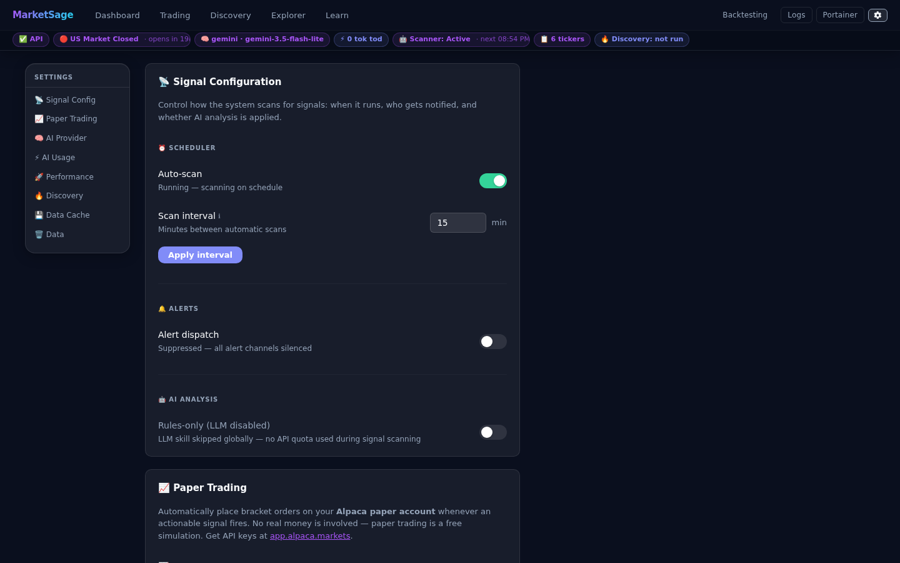

# Settings Reference



All configuration for **MarketSage** is driven by environment variables in `.env`
(copied from `.env.example`). Most can also be changed at **runtime** from the
**Settings page** (⚙ gear in the header) or via the API — no container restart needed.

> Runtime changes are persisted to SQLite (`app_settings` table) and survive restarts.  
> `.env` values act as defaults; the DB value overrides them once set via the UI/API.

---

## Watchlist & scanning

| Variable | Default | Runtime-mutable | Description |
|---|---|---|---|
| `WATCHLIST` | `AAPL,MSFT,NVDA,TSLA,AMD,SPY` | ✓ (via Dashboard add/remove) | Comma-separated tickers to auto-scan. Add/remove from the Dashboard; changes persist to DB. |
| `SCAN_INTERVAL_MINUTES` | `15` | ✓ (Settings page or `POST /settings/scan-interval`) | Minutes between scans while the market is open. Takes effect on the next loop cycle. |
| `SCHEDULER_AUTO_START` | `false` | ✓ (Settings page toggle persists to DB) | Start auto-scan automatically on every container boot. Once toggled via the UI, the DB value takes precedence. |
| `DATABASE_PATH` | `offgrid_trader.db` | ✗ | Path to the SQLite database file. In Docker this is set to `/app/data/offgrid_trader.db` (bind-mounted). |

---

## Ollama (local LLM)

| Variable | Default | Runtime-mutable | Description |
|---|---|---|---|
| `OLLAMA_HOST` | `http://localhost:11434` | ✗ | Ollama server URL. In Docker: overridden to `http://ollama:11434` by Compose. |
| `OLLAMA_MODEL` | `qwen2.5:14b` | ✓ (Settings page or `POST /settings/ollama`) | Model tag. Must already be pulled in Ollama. Match to your GPU VRAM: `3b` ≈ 3 GB, `7b` ≈ 5 GB, `14b` ≈ 10 GB. |
| `OLLAMA_TIMEOUT` | `120` | ✓ (Settings page or `POST /settings/ollama`) | Seconds to wait for an Ollama response before failing. Increase for slow CPU inference. |

To pull a new model without restarting:
```bash
docker exec ollama ollama pull qwen2.5:14b
```

---

## Signal thresholds

| Variable | Default | Description |
|---|---|---|
| `RSI_OVERSOLD` | `30` | RSI below this on 2+ timeframes → long candidate |
| `RSI_OVERBOUGHT` | `70` | RSI above this on 2+ timeframes → short candidate |
| `VOLUME_SPIKE_MULTIPLIER` | `2.0` | Volume must be this many times the 20-day average to trigger volume-spike rule |
| `SIGNIFICANT_MOVE_PCT` | `2.0` | Day price move (%) required alongside a volume spike |
| `CONFIDENCE_FLOOR` | `65` | Minimum 0–100 confidence for a signal to be stored and alerted |

These are read-only from the UI — edit `.env` then `make up` to recreate the container.

---

## Alerts

| Variable | Default | Runtime-mutable | Description |
|---|---|---|---|
| `ALERTS_SEND_ENABLED` | `true` | ✓ (Settings page or `POST /settings/alerts`) | Global on/off for email + Slack. Telegram has its own flag. |
| `EMAIL_ENABLED` | `false` | ✗ | Enable Gmail SMTP alerts. Requires the SMTP vars below. |
| `SMTP_HOST` | `smtp.gmail.com` | ✗ | |
| `SMTP_PORT` | `587` | ✗ | |
| `SMTP_USERNAME` | *(unset)* | ✗ | Your Gmail address |
| `SMTP_APP_PASSWORD` | *(unset)* | ✗ | 16-character Gmail App Password (not your account password). Create at https://myaccount.google.com/apppasswords |
| `EMAIL_FROM` | *(unset)* | ✗ | Sender address |
| `EMAIL_TO` | *(unset)* | ✗ | Recipient address |
| `SLACK_ENABLED` | `false` | ✗ | Enable Slack Incoming Webhook alerts. |
| `SLACK_WEBHOOK_URL` | *(unset)* | ✗ | Incoming Webhook URL from https://api.slack.com/messaging/webhooks |
| `TELEGRAM_ENABLED` | `false` | ✗ | Enable Telegram bot alerts. |
| `TELEGRAM_BOT_TOKEN` | *(unset)* | ✗ | Token from @BotFather |
| `TELEGRAM_CHAT_ID` | *(unset)* | ✗ | Chat or group ID. Get it via `https://api.telegram.org/bot<TOKEN>/getUpdates` |

---

## Optional data sources

| Variable | Default | Description |
|---|---|---|
| `FINNHUB_API_KEY` | *(unset)* | Free key from https://finnhub.io — enables recent news headlines injected into the AI prompt (60 req/min on the free tier). Without a key, the news section of the prompt is empty. |
| `FRED_API_KEY` | *(unset)* | Free key from https://fred.stlouisfed.org/docs/api/api_key.html — enables the FRED REST API (`api.stlouisfed.org`) for macro data. Strongly recommended when running inside Docker behind a corporate VPN, where the key-free CSV endpoint (`fred.stlouisfed.org`) is often blocked. |

---

## Market hours

| Variable | Default | Description |
|---|---|---|
| `MARKET_TIMEZONE` | `America/New_York` | Timezone for market-hours checks |
| `MARKET_OPEN_HOUR` | `9` | Market open hour (24h, local timezone) |
| `MARKET_OPEN_MINUTE` | `30` | Market open minute |
| `MARKET_CLOSE_HOUR` | `16` | Market close hour |
| `MARKET_CLOSE_MINUTE` | `0` | Market close minute |

The scheduler only scans while the market is open (Mon–Fri, 9:30–16:00 ET by default).
Outside these hours it sleeps until the next interval.

---

## OpenTelemetry / Aspire

| Variable | Default | Description |
|---|---|---|
| `OTEL_EXPORTER_OTLP_ENDPOINT` | *(unset)* | OTLP gRPC endpoint for traces, metrics, and logs. In Docker this is set automatically to `http://aspire-offgrid:18889`. Leave empty to disable telemetry. |
| `OTEL_INCLUDE_LLM_CONTENT` | `false` | When `true`, full LLM prompt and response text are added as span events in Aspire. Default `false` — prompts contain financial context (balance sheet figures, news). Enable only in development. |

See [observability.md](observability.md) for the full span hierarchy and how to read traces in Aspire.

---

## Applying changes

| Change type | How to apply |
|---|---|
| Runtime-mutable (Settings page) | Instant — no restart |
| Runtime-mutable (API `POST`) | Instant — no restart |
| `.env` change (non-runtime) | `make up` — recreates containers so new env is read. **`docker compose restart` alone does NOT work** — it reuses the old environment. |
| `.env` change to `WATCHLIST` | `make up` — note any runtime add/remove overrides survive in the DB |

---

## Runtime settings storage

Runtime-mutable settings are persisted in the `app_settings` SQLite table
(key-value store). Inspect or reset them:

```bash
# Show all stored runtime settings:
sqlite3 data/offgrid_trader.db "SELECT key, value FROM app_settings;"

# Reset the scheduler state to off (force manual mode on next restart):
sqlite3 data/offgrid_trader.db "DELETE FROM app_settings WHERE key = 'scheduler_running';"

# Clear all signals and analysis log (preserves settings):
curl -X POST http://localhost:8010/data/reset
```
